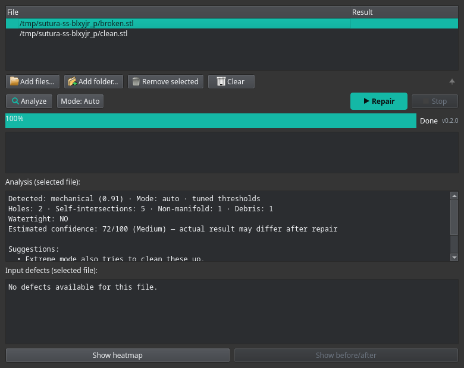
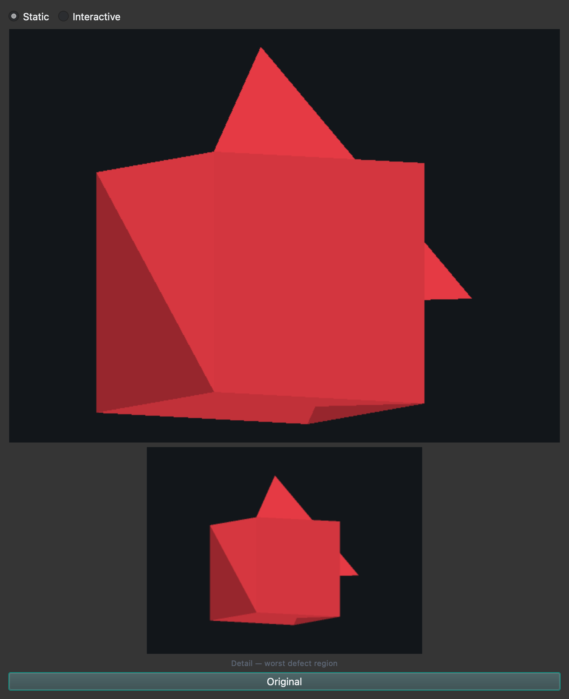

# Sutura

<p align="center">
  
</p>

<p align="center">
  
  
  
  
  
  
  
  
  
  
</p>

Two-stage mesh repair for STL, OBJ and 3MF files, built for Linux with full
macOS support.

Linux has no direct equivalent of Windows' right-click "Fix model" (3D Builder,
Netfabb) or Bambu Studio's broken-on-Linux "Fix model" button. Sutura provides
that workflow: pick a mesh, repair it, keep the original untouched.

Sutura is continuously hardened against real-world inputs — Thingi10K models,
malformed files, adversarial inputs and torture scenarios (huge meshes, thin
walls, multi-part assemblies) — and every change is verified automatically by
CI on each push and pull request.

**What you can rely on.** The two-stage STL repair pipeline (VCG + manifold3d)
is validated on a 115-mesh real-world scan corpus with a strict
`defects.detect()` closed-loop check: 103/115 (~90%) genuinely watertight, 0
crashes, every pipeline claim confirmed 1:1, and an independent manifold3d
re-check agrees on all 115 meshes. Defect detection is a single
stdlib+numpy source of truth, unit-tested on clean and broken meshes. The
mesh-type classifier (default engine) is calibrated on a 71-mesh labeled set
and measurably beats the classic heuristic. These are the features to trust
first; the experimental/opt-in items are clearly labelled as such below.

**A note from the maintainer**

Sutura is developed by a single maintainer alongside a full-time aircraft
maintenance role at a major airline. Releases may come less frequently for
a while going forward — the project is not abandoned, only slower-paced.

## Screenshot


## Why two stages

* **Stage 1 - PyMeshLab (VCG).** Removes duplicate and degenerate faces,
  repairs non-manifold edges and vertices, orients faces coherently, closes
  holes of *any* size, and drops tiny open debris components. VCG is the
  battle-tested classic for 3D-printing repair.
* **Stage 2 - manifold3d.** Rebuilds the closed mesh as a valid manifold
  solid and merges overlapping shells with a boolean union. This is the same
  library Bambu Studio uses; it guarantees the output is a single closed
  two-manifold.

Each stage fixes what the other cannot: VCG closes big holes but does not
resolve self-intersecting geometry; manifold3d guarantees a watertight result
but its Python binding rejects any input that is not already closed
(`Error.NotManifold`), so stage 1 must finish the mesh first.

On Linux, stage 2 runs in a dedicated python3.11 virtualenv (manifold3d
ships no wheel for Python 3.14). On single-environment installs (macOS/conda,
or any setup where manifold3d is importable from the current Python), stage 2
runs in-process instead. If manifold3d is not available at all, the report
explicitly says `Stage 2 skipped: manifold3d not available in this
environment.` — it is never silently omitted.

The original file is never overwritten. Output is written with a `_fixed`
suffix in the same directory.

## Feature status

A honest maturity snapshot of each major area — what is solid, what is a
known limitation, and where to be cautious. The percentages are an
assessment, not a metric; they are meant to tell you where you can trust
Sutura and where you should still double-check the output.

| Area | Maturity | What is solid / where to be careful |
|---|---|---|
| STL repair (two-stage) | ~96% | The VCG + manifold3d pipeline is CI-hardened against malformed/adversarial/torture inputs and validated on a 75-model real-world corpus (0 hard failures; the stage-1 chain was reordered and `maxholesize` made mesh-sensitive so large scan holes close) plus a 115-mesh real-world scan corpus (re-measured with a strict `defects.detect()` closed-loop check on the actual output geometry: 0 crashes, 103/115 = ~90% strictly watertight, every pipeline claim confirmed 1:1 — see `docs/repair-benchmark-strict-watertight-2026-09.md`). Not 100%: pathological self-intersections can be reshaped by the stage-2 rebuild, and the last few stubborn holes / heavy non-manifold structures on scan meshes are a genuine VCG limit. |
| 3MF multi-object | ~92% | Every object is repaired independently in memory and written back, so no object is lost. An object that stage 1 closes now gets a **per-object stage 2** (manifold3d watertight rebuild) through the same shared helper as single-mesh files: per-object `stage2` reports, `objects_watertight` / `objects_stage2_ok` aggregates, and the file-level verdict considers ALL objects (not just object 0). Byte-identical objects reuse one repair but each still gets its own report. A layered/duplicated-vertex (Bambu-style) 3MF is fixed at Stage 1 (a second duplicate-faces pass after vertex dedup) and repairs to 12 faces / 0 holes per object, confirmed watertight by per-object stage 2. Regression-tested (`tests/test_stage2_3mf.py`). Known limits: per-object stage 2 only applies to objects that stage 1 actually closes (open objects are stage-1 output), the object-0 `stage1`/`stage2` top-level fields are kept for backward compatibility, and the `<vertex>` parser assumes the x,y,z attribute order. |
| Defect detection (holes / non-manifold) | ~90% | Stdlib+numpy, single source of truth, unit-tested on clean and broken cubes. Not 100%: it reports input defects only; on a mesh with thousands of micro-cracks the per-defect list gets large, and the CLI JSON omits index data (rendering-only). |
| GUI | ~89% | Native Qt batch repair, drag & drop, defect panel, pre-repair analysis with mode suggestions, heatmap, before/after comparison (static + interactive 3D viewer with surface deviation), **a color-coded defect view** (red = non-manifold, orange = flipped winding, yellow = degenerate face — FAZ11), a **"what changed" repair log panel** (holes closed, non-manifold edges fixed, faces removed, components, stage 2 — FAZ11), **opt-in experimental checkboxes** (edge-tiebreak classifier head; join-small-components — FAZ14; autorefine self-intersection resolution — FAZ16; fTetWild fallback — FAZ17), repair-mode picker + repair-profile dropdown, status/version row, i18n (EN/TR). Gaps: it shells out to the CLI (no in-process progress), the native KDE file dialog only works when the system Qt matches PySide6's, and on macOS Finder right-click repair is provided by the separate Quick Action rather than the GUI itself. |
| CLI | ~90% | Stable flags (`-o`, `--human`, `--defects`, `--diff`, `--mode`, `--profile`, `--dry-run`, `--version`), the read-only `validate` subcommand, JSON reports, batch summary, exit codes. Plus experimental/prototype flags: `--experimental-join-components` (moves small components onto the nearest larger one instead of deleting them; changes geometry, evaluation only), `--experimental-autorefine` (resolves self-intersections by subdividing the intersecting triangles along their intersection segments — Lazard & Valque 2025 — instead of deleting faces; NEVER deletes input faces; adopted only when its final output is not worse than the default chain; on moderate-SI meshes it reduces SI, on dense-SI scans the float64 construction is limited — see `docs/alpha-wrap-feasibility-2026-09.md`), `--experimental-fallback-ftetwild` (last-resort solidifier: when stage 1 still leaves self-intersections/holes/non-manifold edges, tetrahedralizes the ORIGINAL input with fTetWild via pytetwild — MPL-2.0 — and extracts a watertight, SI-free boundary; adopted only when no worse on holes+non-manifold; measured 100281 3677→0 SI in ~55s) and `--experimental-edge-tiebreak` (opt-in 11-feature classifier head — base features + the five strong FAZ10 scan signals; the gain is marginal, 1 mesh on the 71-mesh labeled set, but the signal is statistically real; NOT the default). The `--human` report is English-only (localization is a GUI concern). |
| Batch processing | ~90% | Multi-file repair with per-file results and a summary. Hard stops (Ctrl-C / Stop) are handled; the batch summary is not resumable and a failed file does not halt the rest. |
| Defect heatmap | ~80% | On-demand CPU rasterizer (no GL), runs in a subprocess, never crashes the GUI. Deliberately CPU-only: offscreen OpenGL segfaults on headless systems, so it is flat-shaded with a three-point lighting model rather than full GL shading, and for multi-object 3MF it renders only the first object. |
| Before/after comparison | ~80% | Static CPU-rasterized toggle between original and repaired views with a **worst-defect zoom detail** close-up and a tri-state colour scheme (grey = never broken, green `(46,204,113)` = healed, orange `(255,140,60)` = still broken). The healed map is spatial (repaired-face centroids vs original defect extents) and capped at the 256 largest defects so scan meshes stay fast. A **Static/Interactive** switch adds a CPU interactive 3D view (drag to rotate, wheel to zoom, LOD while dragging then a full-resolution final frame) and a **surface-deviation** mode (per-vertex repaired→original distance via pymeshlab's nearest-surface-point filter + global Hausdorff max), both built lazily on first use and cached per dialog; the interactive LOD target is tuned against the 75-model corpus (median ~71 FPS at 720×540). Same GL constraint as the heatmap means it stays a CPU rasterizer; only the first object is compared for multi-object 3MF. Regression-tested (`tests/test_healed_mask.py`, `tests/test_before_after_render.py`, `tests/test_viewer_data.py`, `scripts/verify_before_after_dialog.py`). |
| Validate (`sutura validate`) | ~55% (beta) | New in 0.1.8-beta.1: read-only analysis of holes / non-manifold regions / self-intersections / connected components / signed volume (orientation) / surface area with a watertight verdict — no repair, no output file. Beta quality: the combined metrics are new and not yet calibrated against real-world repair outcomes, and multi-object 3MF validates each object but keeps only a minimal aggregate report. It has a dedicated regression suite (`tests/test_validate.py`). |
| Dry-run (`--dry-run`) | ~50% (beta) | New in 0.1.8-beta.1: reports the would-do plan (detected type, mode, Stage 1 thresholds, found holes / debris / self-intersections, stage 2 availability) and writes nothing. Beta quality: the plan is derived from the input analysis, so exact hole-close counts are not guaranteed to match a real run, and the extreme-mode extra passes are not simulated. It is covered by `tests/test_validate.py` (validate and dry-run share the suite). |
| Repair modes (`--mode` ladder) | ~80% | Five-step aggressiveness ladder (`low`/`medium`/`auto`/`aggressive`/`extreme`) for the Stage 1 thresholds, exposed both as a CLI flag and a batch-wide GUI picker; `auto` keeps the historical classifier + confidence-gate behaviour byte-identical and is regression-tested (`tests/test_repair_mode.py`). The mode fixes the BASE `maxholesize`, which is then raised mesh-sensitively (`max(base, 2 × longest input loop)`, never lowered) so large scan holes close in every mode. Caveats: `extreme` can delete a small object (reported as the distinct `extreme_removed_object` error, not malformed input) and the per-type tuned threshold values are experimental. |
| Repair profiles (`--profile`) | ~70% (new) | Five named Stage 1 threshold presets (`mechanical`/`organic`/`scan`/`miniature`/`fast`), opt-in via CLI or a batch-wide GUI dropdown; only effective while the mode is `auto` (an explicit fixed mode wins). Default (no profile) is byte-identical to before. Caveat: `miniature` lowers `mincomponentsize` to 1 (a deliberate opt-in that preserves tiny parts; the default path keeps it `>= 8`). |
| Mesh type-aware repair | ~75% | Heuristic mechanical/organic guess tunes two Stage 1 thresholds, gated by a per-class confidence gate (mechanical ≥ 0.75, organic ≥ 0.70) and measured by a calibration harness (`scripts/calibrate_classifier.py`). The **default** engine is the **experimental** one (`sutura/mesh_classifier_v2.py`): RANSAC plane segmentation + a curvature developability signal + a small trained head. On the 40-mesh real-world corpus (36 labeled) it scores 29/36 vs classic's 16/36 (mechanical recall 16/20 vs 2/20 — the classic scanner-bias limitation is much more visible on the expanded corpus), LOO-CV on the 71-mesh labeled set 0.845 vs classic 0.648. It classifies curved-but-mechanical parts (cylinders, tubes, fillets) that classic reads as unknown, and falls back to classic silently on exceptions/invalid results; `--classifier-engine classic` / `SUTURA_CLASSIFIER_ENGINE=classic` still selects the old engine. A **near-boundary classic-agreement fallback** keeps the head's class but inherits classic's confidence when the head is a coin-flip (`|p_mech − 0.5|·2 < 0.15`) and classic strongly agrees (class-score ≥ 0.70), so a strong agreeing signal is never lost to the tuning gate (this restored `artec_metal-nut.stl` to watertight — 103/115 on the scan corpus). Experimental: the per-type values are estimated starting points, hard free-form/curved samples (a bent pipe, a spiral pipe, a curved hook, decorative bowls read as mechanical) are still missed, and a confident-but-wrong v2 prediction is not re-checked against classic — treat the detected type on scan-derived input with caution. |
| Repair confidence score | ~70% (beta) | Combines existing repair signals (stage 2 outcome, remaining holes, classifier confidence, tuning status, repair mode, self-intersections, volume change) into a single 0–100 score with a High/Medium/Low label: `repair_confidence` on repaired files, `estimated_confidence` on validate / --dry-run (with a "result may differ" caveat). Regression-tested (`tests/test_confidence.py`). Experimental: the weighting model is new and not yet validated against real user feedback. |
| Repair Health / Risk | ~60% (new) | A separate, additive scoring system on top of the classic confidence: `repair_health` (0–100, final-mesh soundness: watertight + no non-manifold/self-intersections/holes) and `repair_risk` (0–100, how much the repair altered the mesh: face/vertex/component/volume deltas), plus a two-axis status label (`safe`/`review`/`caution`/`failed`/`unavailable`) derived from a config lookup table. Weights/thresholds live in `sutura/repair_score_config.json`, not code; fail-silent (never breaks a repair); regression-tested (`tests/test_repair_score.py`). Experimental: the weight values and tier boundaries are starting points. |
| Repair budget (`--max-geometry-change` / `--max-risk` / `--force`) | ~60% (new) | Optional guard-rails: when the actual geometry change (max of \|volume\|/\|surface\| change %) or the `repair_risk` score exceeds the budget, the output is never saved silently — interactive `[y/N]` prompt on a TTY, else the save is declined with the explicit `"status": "budget_declined"` marker (issue `budget_exceeded`, exit 1), and `--force` saves without asking. Within budget the numbers are still reported (`budget` block). Reuses the existing volume/surface/risk metrics (no recomputation); the GUI offers the same budgets and re-runs declined files with `--force` after confirmation. Regression-tested (`tests/test_budget.py`). Experimental: 0 = no limit, and a declined save means the file is simply not written. |
| Unit detection warning | ~60% (new) | Non-blocking bounding-box heuristic that flags models probably authored in inches/centimetres instead of millimetres (`unit_warning` + `unit_hint` in JSON, a `WARNING:` line in `--human`, and shown in the GUI log / analysis pane / defect panel). 3MF `<model unit="...">` declarations are honoured: a declared inch/centimetre unit is reported as-is, a declared millimetre unit (the spec default) is trusted and suppresses the heuristic. Never changes the repair — informational only. Regression-tested (`tests/test_units.py`). Experimental: the 25–400 mm "plausible printable part" range and the inches-before-centimetres ordering are heuristics, not calibration. |
| Cross-platform (Linux/macOS) | ~80% | Linux (install.sh + AppImage) and macOS (conda) both work, CI covers both; each release also ships an unsigned macOS `.dmg` (`Build macOS .app/.dmg` workflow) and macOS installs get a native `~/Applications/Sutura.app` so the GUI launches from Spotlight (Cmd+Space → "Sutura"), plus a Finder **Quick Action** (`~/Library/Services/Sutura Quick Action.workflow`) for right-click repair. Gaps: the AppImage/GUI cannot self-update in place (read-only squashfs), the .dmg is not notarized (shows Gatekeeper's "unidentified developer" warning), and macOS has no standalone uninstall script (see "Removing a macOS install" below). |
| Auto-update | ~75% | Opt-in, backs up and rolls back on a failed self-check. The version check understands prerelease tags, so beta testers are offered the stable release once it is out. Auto-update stops at the v0.2.0 license boundary: a v0.1.x install is never silently upgraded across it (the new terms are shown first and the release must be installed manually from the releases page). Caveats: it is Linux/pip-install only (AppImage downloads a new release instead), and it talks to GitHub so it is not offline. |
| Dolphin integration | ~85% | Right-click service menu for STL/OBJ/3MF, single/multi-select handled. Depends on KDE Plasma and `kbuildsycoca6` refresh; not available on other file managers or macOS. |
| OrcaSlicer plugin | ~70% — experimental | Self-contained script plugin that repairs the **currently selected model** in-memory via `orca.host` (numpy-free accessors), shelling out to the Sutura CLI and loading the result back. Verified end-to-end in a real OrcaSlicer **2.5.0-dev** (macOS); primary target is Linux, macOS is a verified bonus. Native progress dialog during repair; `request_permissions` pre-declares the CLI path's fs_read (subprocess prompts remain, an OrcaSlicer audit-API limitation). Still early-stage; requires nightly / releases newer than 2.4.2. |
| Test coverage | ~89% | Plain-script suites (smoke, layered 3MF, adversarial, classification, confidence, defects, heatmap frames, healed-mask, before/after render, viewer data, validate/dry-run, mesh classifier, repair mode, suggestions, updater, obj repair, units, budget, stage2-3mf, torture) run in CI on push/PR. Not 100%: the GUI itself has no automated UI test, and there is no reproducible end-to-end test against a live OrcaSlicer. |

## Requirements

Linux:

* `python3` (>= 3.11) with venv support, for the PyMeshLab venv
* `python3.11` specifically, for the manifold3d venv (manifold3d ships
  wheels only up to Python 3.13)
* KDE Plasma for the Dolphin service menu (optional; CLI and GUI work anywhere)

macOS (Apple Silicon / Intel):

* Homebrew and Miniforge (conda). pymeshlab has no PyPI wheel for Apple
  Silicon, so it must come from conda-forge; this is why macOS uses a single
  conda environment (`install-macos.sh`) rather than the Linux pip-only flow.
* Install Python 3.11 via conda (`install-macos.sh` does this automatically).

Linux Python 3.11 install:

* Arch / CachyOS: `sudo pacman -S python311`
* Debian / Ubuntu 22.04+: `sudo apt install python3.11 python3.11-venv`
* Fedora: `sudo dnf install python3.11`

On other distros, if your default `python3` *is* 3.11, no extra install is
needed.

## Troubleshooting

* **`python3.11` not found.** Stage 2 (manifold3d) needs Python 3.11 because
  it ships wheels only up to 3.13. Install it per distro:
  * Arch / CachyOS: `sudo pacman -S python311`
  * Debian / Ubuntu 22.04+: `sudo apt install python3.11 python3.11-venv`
  * Fedora: `sudo dnf install python3.11`
  Then run `install.sh` again — it reuses the existing virtualenvs.
* **PySide6 install fails.** The GUI needs `PySide6-Essentials`, which is
  installed into the `venv` from PyPI. On distros where `pip install
  PySide6-Essentials` fails (missing build tooling or a blocked PyPI), install
  the system Qt Python bindings instead and point the entry point at them:
  * Debian/Ubuntu: `sudo apt install python3-pyside6`
  * Fedora: `sudo dnf install python3-pyside6`
  * Arch: `sudo pacman -S pyside6` (in the official `extra` repository)
* **The GUI has no KDE file dialog.** The native dialog needs `plasma-integration`
  and a system Qt version that matches PySide6's. If the rubber-band selection
  is missing, Qt falls back to its embedded dialog — Ctrl/Shift+click still
  work for multi-selection.
* **macOS: `pip install pymeshlab` fails or pulls an Intel build.** PyMeshLab
  has no Apple Silicon PyPI wheel — install from conda-forge
  (`conda install -n sutura-env -c conda-forge pymeshlab`, see
  `install-macos.sh`). The install is a directory of native VCG plugins
  (`pmeshlab.*.so`, `PlugIns/*.so`, `lib/*.so`, `Frameworks/*.dylib`)
  loaded at import; if a filter reports "not loaded", the `PlugIns/` dir is
  missing next to the package. When bundling with PyInstaller you need
  `--collect-data pymeshlab`, not just a hidden import.
* **Headless GUI "hangs" right after launch.** The first run (no config at
  `~/.config/sutura/config.json`) opens a **modal** update/usage-history
  dialog and blocks until answered. To run headless, pre-seed the config,
  e.g. `{"check_for_updates": false, "history_enabled": true}`. The update
  prompt is skipped for AppImage builds; the history prompt is always asked
  on first run.
* **macOS: `grep: empty (sub)expression` on every `git push`.** The pre-push
  security hook's secret pattern used an empty alternation branch that BSD
  grep rejects, so the secret scan silently never ran. Fixed in
  `scripts/pre-push-security-check.sh` (optional group) — reinstall the hook
  with `./install.sh` / `./install-macos.sh`.
* **Standalone .app: stage 2 reports skipped / low confidence.** Stage 2
  (manifold3d) needs `manifold_bridge.py` next to the bundled CLI (e.g.
  `Sutura.app/Contents/MacOS/sutura-cli/manifold_bridge.py`) with
  `manifold3d`/`trimesh` bundled; otherwise `stage2_bridge_available=false`
  and confidence drops ~25 points.

## Install

### Linux

One line (fetches the latest `main` and installs):

```sh
curl -fsSL https://raw.githubusercontent.com/Krateian/Sutura/main/install.sh | bash
```

Or from a clone:

```sh
git clone https://github.com/Krateian/Sutura.git
cd Sutura
./install.sh
```

This creates two virtualenvs under `~/.local/share/sutura`, installs the CLI
wrapper at `~/.local/bin/sutura`, installs the hicolor app icons, and
registers the Dolphin service menu. Re-running is safe.

**AppImage (optional).** A self-contained AppImage with both Python runtimes
bundled (3.14 for stage 1 + GUI, 3.11 for stage 2) — no virtualenvs and no
system `python3.11` needed. Each tagged release ships a prebuilt
`Sutura-x86_64.AppImage` on the
[GitHub releases page](https://github.com/Krateian/Sutura/releases); you can
also build it yourself with `scripts/build_appimage.sh` (produces
`dist/Sutura-x86_64.AppImage`). Make it executable and run:

```sh
chmod +x Sutura-x86_64.AppImage
./Sutura-x86_64.AppImage            # GUI
./Sutura-x86_64.AppImage model.stl  # CLI (writes model_fixed.stl)
```

Unlike the `install.sh` flow, the AppImage build cannot update itself in
place; grab a new AppImage from the releases page above. The Dolphin
right-click service menu is still installed by `install.sh`.

Installation uses pip inside isolated virtualenvs — no AUR, no yay/paru
required, nothing touches your system package manager. The GUI needs
PySide6 (~79 MB download, part of the `venv`); total installed size for
the two virtualenvs is roughly 800 MB.

On Arch, if `python311` is not installed, install it first (see above).

### macOS

```sh
git clone https://github.com/Krateian/Sutura.git
cd Sutura
./install-macos.sh
```

`install-macos.sh` checks for Homebrew, installs Miniforge via Homebrew if
conda is missing, creates a `sutura-env` conda environment (Python 3.11),
installs pymeshlab from conda-forge and manifold3d/trimesh/PySide6 from pip,
verifies the imports, copies the app files to `~/.local/share/sutura/`, and
creates `~/.local/bin/sutura` (CLI) and `~/.local/bin/sutura-gui` launchers.
It also creates a native **`~/Applications/Sutura.app`** so you can launch the
GUI straight from **Spotlight** (press `Cmd+Space`, type *Sutura*, Enter) —
no terminal needed. It is macOS-only and re-runnable.

The installer also adds a Finder **Quick Action** ("Sutura — Repair"): select
one or more STL/3MF files in Finder, right-click → *Quick Actions* → *Sutura —
Repair*. Each file is repaired with the bundled CLI and a native macOS
notification reports the result — a single file shows `Health: X/100  Risk:
Y/100  Status: <label>`, a batch shows one summary (`N/M repaired, K failed —
see log`). The log for each run is written to
`~/Library/Logs/Sutura/sutura-<timestamp>.log`. Non-STL/3MF files are skipped
and reported. The Quick Action locates a PyInstaller `Sutura.app` in
`/Applications` or `~/Applications`; if it is a downloaded (quarantined) copy,
the notification tells you to right-click → Open `Sutura.app` once first.
Because the Quick Action calls the bundled `sutura-cli`, it does not need this
conda environment to be installed.

**Removing a macOS install (manual):** there is no macOS uninstall script —
the Linux `uninstall.sh` only covers the KDE/Linux artifacts. To remove a macOS
installation manually, delete:
- `~/Applications/Sutura.app` (the Spotlight wrapper) and/or the `.app` in
  `/Applications`
- `~/.local/share/sutura/` (app files, including `macos-quick-action.sh`)
- `~/.local/bin/sutura` and `~/.local/bin/sutura-gui`
- `~/Library/Services/Sutura Quick Action.workflow` (the Finder Quick Action)
- `~/Library/Logs/Sutura/` (repair logs)
- optionally the `sutura-env` conda environment (`conda env remove -n sutura-env`)

Note: conda can be initialized non-interactively; if the script asks you to
restart the terminal for `conda init` to take effect, do so and re-run it.

Each tagged release also ships a **macOS .dmg** (`Sutura-vX.Y.Z.dmg`, built
by the `Build macOS .app/.dmg` workflow) — a self-contained
`Sutura.app`. Drag it to `/Applications` (or double-click to open) and launch
from Spotlight the same way. The .dmg is **unsigned** (no Apple Developer
Program / notarization applied yet), so the first open shows macOS's
*"unidentified developer"* warning. Open it with **right-click → Open**, or clear the
quarantine attribute first:

```sh
xattr -dr com.apple.quarantine Sutura.app
```

## Usage

Runs fully offline after installation — no telemetry, no network calls
during repair, works without internet once installed.

Sutura checks GitHub for updates only if you opt in (disabled by default).
Updates back up the previous install automatically and roll back if the new
version fails a self-check — no data beyond the update check itself is sent.
Auto-update stops at v0.2.0: starting with v0.2 the license changes to the
PolyForm Noncommercial 1.0.0 (commercial use requires a separate agreement),
so a v0.1.x install is never silently upgraded across that boundary — the new
terms are shown first and the release must be installed manually from the
releases page.

CLI:

```sh
sutura model.stl            # writes model_fixed.stl
sutura model.obj            # writes model_fixed.obj
sutura model.3mf -o fixed.3mf
sutura model.stl --human    # human-readable report
sutura model.stl --human --defects   # also list input holes / non-manifold regions
sutura model.stl --human --diff      # also print the before/after geometry diff
sutura model.stl --mode aggressive   # use the aggressive repair mode
sutura model.stl --classifier-engine classic  # force the classic classifier engine
sutura model.stl --max-geometry-change 10 --max-risk 40   # repair budgets (see below)
sutura model.stl --max-risk 30 --force                    # save even past the budget, no prompt
sutura validate model.stl   # analyze WITHOUT repairing (read-only report)
sutura model.stl --dry-run  # report what a repair would do, write NOTHING
sutura a.stl b.3mf c.stl    # batch: each file gets a _fixed output
sutura --version            # print the version and exit
```

OBJ note: materials/textures (`mtllib`/`usemtl`) are **not preserved** in the
repaired output — the mesh is rebuilt (vertices + triangles only), so texture
coordinates cannot be carried over. The report flags this as
`material_discarded` (JSON) and with a `Material:` line (`--human`) when the
input OBJ references them. 3D slicers ignore OBJ materials, so this only
matters if you keep the repaired OBJ for texturing.

**Validate (`validate`).** `sutura validate model.stl` analyzes a mesh and
reports it without repairing or writing anything — a read-only health check.
The JSON report carries `validation` (`holes` / `non_manifold` lists with
centroid + diameter / face counts, `self_intersections`, `connected_components`,
`watertight`, `signed_volume`, `surface_area`, `orientation`), plus
`detected_type` and `detected_confidence` from the mesh classifier.
`--human` prints it readably (`--defects` lists each defect region).
Multi-object 3MF files validate per object (`object_reports`). Exit 0 means
the analysis ran (even on a broken mesh); a missing / malformed input exits 1.

**Dry-run (`--dry-run`).** `sutura model.stl --dry-run` tells you what a
repair WOULD do without doing it: the detected type, the resolved repair
mode and exact Stage 1 thresholds (`mincomponentsize` / `maxholesize`),
`tuning_applied`, and what was found on the input (`holes_found` / largest
hole diameter / `non_manifold_regions` / `self_intersections` /
`debris_faces_removable`) plus whether stage 2 would run. It writes **no
output file at all** — no `_fixed`, no temp residue. The thresholds come from
the same `resolve_mode_params` the real repair uses, so the two can never
diverge.

**Repair mode (`--mode`).** A five-step aggressiveness ladder for Stage 1
thresholds, defaulting to **`auto`** (which is the historical behaviour: the
mesh classifier + confidence gate pick per-type thresholds). The fixed modes
bypass the classifier and use exact thresholds:

| Mode | `mincomponentsize` | `maxholesize` | Effect |
|---|---|---|---|
| `low` | 8 | 200 | most conservative: closes only small holes, minimal debris removal |
| `medium` | 8 | 1000 | the historical default thresholds |
| `auto` | — | — | classifier + confidence gate (default); type-dependent, so not fixed |
| `aggressive` | 12 | 3000 | more debris removed, larger holes closed |
| `extreme` | 20 | 10000 | most aggressive; note this can delete an object whose whole connected part has fewer than 20 faces — when that happens the report carries a distinct error (`category=error`, issue `extreme_removed_object`), not a generic malformed-input error. On top of the extreme thresholds it runs **extra self-intersection passes**: any self-intersecting faces are removed and the Stage 1 chain (hole closing + debris removal) runs a second time to catch what the removal exposed. Deliberately **not** a full remesh (`meshing_isotropic_explicit_remeshing` is out of scope — it can unpredictably change topology). |

The chosen mode is always reported (`repair_mode` in JSON, `Mode:` in
`--human`; per object for multi-object 3MF). For `extreme`, the report also
carries `extreme_passes_applied` (true when the extra passes ran) and, when
they did, `self_intersections_found`/`self_intersections_removed`; `--human`
shows an "Extreme passes" line. The GUI exposes the same five modes through
its **Mode** button (batch-wide, see the GUI section below).

**Repair profile (`--profile`).** An opt-in named preset for a repair
character, useful when you know the input's kind. Only effective while the
mode is `auto` — an explicit fixed mode always wins (it is the more specific
aggressiveness control). The classifier still runs (its type/confidence stay
in the report) but does not drive the thresholds:

| Profile | `mincomponentsize` | `maxholesize` | When to use |
|---|---|---|---|
| `mechanical` | 8 | 300 | precise/mechanical parts (modest hole fill) |
| `organic` | 12 | 1000 | smooth/organic models (drop debris, close larger regions) |
| `scan` | 4 | 10000 | scan meshes: aggressive debris removal + huge hole fill |
| `miniature` | 1 | 50 | tiny parts you want preserved (opt-in: the default path keeps `>= 8`) |
| `fast` | 8 | 200 | a quick pass that only closes small holes |

The chosen profile is reported (`repair_profile` in JSON, `Profile:` in
`--human`). Default (no `--profile`) is byte-identical to before. The GUI
exposes the same profiles through a **Profile** dropdown (batch-wide).
`sutura model.stl --profile scan` is equivalent to the old
`--mode aggressive`-style scan handling but keeps the mode at `auto`.

**Unit warning.** STL/OBJ files carry no unit metadata, and the size-based
repair thresholds (hole size, debris cutoff) assume millimetres. After
loading a mesh, Sutura computes its bounding box and, when the dimensions are
only plausible when scaled from inches or centimetres to millimetres, emits a
NON-BLOCKING warning (`unit_warning` + `unit_hint` in JSON, a `WARNING:` line
in `--human`, and a visible warning in the GUI) that the model may not be in
mm — verify the scale before printing. 3MF files declare their unit in the
`<model unit="...">` attribute: a declared inch/centimetre unit is reported
as-is, a declared millimetre unit (the spec default) is trusted and
suppresses the heuristic. The warning never changes the repair itself.

**Repair budget (`--max-geometry-change` / `--max-risk` / `--force`).** Two
optional guard-rails on how much a repair is allowed to alter a mesh, both
reusing metrics the repair already computes:
- `--max-geometry-change PCT` — the actual geometry change is
  `max(|volume change %|, |surface area change %|)`; a budget above this
  value is exceeded.
- `--max-risk SCORE` — the `repair_risk` score (0–100); a budget below the
  actual score is exceeded.
- `0` (or omitting the flag) disables a budget; the default is no budget at
  all, so existing behaviour is unchanged.

When a budget is exceeded the output is **never saved silently**: on an
interactive terminal you are prompted (`Save anyway? [y/N]`), and
non-interactive runs (the GUI subprocess, scripts, file-manager integration)
decline the save with exit 1. The report then carries the explicit top-level
`"status": "budget_declined"` marker (plus a `budget` block with the actual
numbers vs. the budgets, and the issue `budget_exceeded`) — a distinct,
machine-detectable outcome, separate from a generic repair error. `--force`
saves without prompting (the budget is still reported). When the repair is
within budget, saving proceeds normally and the `budget` block reports the
actual numbers so you can see they stayed inside the budget. For multi-object
3MF the WORST object drives the comparison. The GUI exposes the same two
budgets in its repair-options dialog and, after a batch, offers to re-run
budget-declined files with `--force` after an explicit confirmation.

Every repair report also carries a **repair confidence score**: a single
0–100 value (`repair_confidence` in JSON) with a High/Medium/Low label that
combines the stage 2 outcome, remaining holes, classifier confidence, tuning
status, repair mode, self-intersections and volume change; `--human` shows it
as a `Confidence: X/100 (Label)` line. The read-only modes report an estimate
instead, because the post-repair signals are not known yet: validate and
`--dry-run` carry `estimated_confidence` and print
`Estimated confidence: X/100 (Label) — actual result may differ after repair`.

Every repair report also carries **Repair Health / Repair Risk** — a separate
scoring system (independent of the classic confidence score, configurable via
`sutura/repair_score_config.json`):
- `repair_health` (0–100) — how geometrically sound the final mesh is: a
  weighted sum of watertight (stage 2 confirmed), no non-manifold edges, no
  self-intersections, no remaining holes.
- `repair_risk` (0–100) — how much the repair altered the mesh: face/vertex
  delta %, component changes, and volume delta %.
- `repair_status` / `repair_status_code` — a two-axis label derived from the
  Health/Risk tier combination via a config lookup table: `safe` ("Safe to
  inspect"), `review` ("Review recommended"), `caution` ("Caution advised"),
  `failed` ("Failed / inspect"), or `unavailable`. Health and Risk are
  independent axes, so a high-health + low-risk repair (`safe`) never
  collapses to the same status as a mid-health + high-risk one (`caution`).
  The per-factor contributions are also reported
  (`repair_health_factors` / `repair_risk_factors`).

`--human` shows them as `Health: X/100   Risk: Y/100   Status: <label>`.
Scoring is fail-silent: any missing/invalid metric is skipped (its weight
redistributed), and scoring never breaks a repair. Multi-object 3MF reports
carry these per object. The GUI defect panel shows them in the selected
file's header line.

With multiple files, every input is repaired in turn and a summary is
printed (`N watertight, M with warnings, K failed`), including a breakdown of
the kinds of warnings/errors that occurred (volume change, Stage 2 skipped,
partial repair, malformed input, extreme-mode object deletion). The exit code is non-zero if any file
failed. In JSON mode each file's report also carries a `category`
(`watertight`/`warning`/`error`) and an `issues` list, and the batch summary
gains `summary.issue_counts`. `-o` is only valid with a single file. In JSON
mode each file's report also includes a `defects` list describing the input's
holes (centroid, diameter) and non-manifold regions; in `--human` mode this
list is shown only when `--defects` is passed, so the default report stays
concise. Diameter values assume millimetres, the common STL/3MF convention;
if your file uses a different unit, scale the interpretation accordingly
(Sutura also flags likely non-millimetre models with a unit warning — see the
Unit warning section above).

Every report also records the before/after geometry in `stage1`:
`volume_change_percent` (signed), `surface_area_before`/`after` and
`surface_area_change_percent`, and `vertices_before`/`after`,
`faces_before`/`after`. These are always in the JSON and shown per object for
multi-object 3MF files; `--human --diff` prints them too, and the GUI defect
panel shows a one-line summary ("Volume: +0.12% · Surface: -2.37% · Vertex:
12→9").

A mesh is only counted as **watertight** when stage 2 ran and
validated the closed solid. If stage 1 closes a mesh but stage 2 is skipped,
errors, or never runs (for example the macOS/conda in-process fallback being
unavailable), the file is reported as a warning, not watertight.

Multi-object 3MF files are handled natively: every object mesh is repaired
independently and written back into the archive, so no object is lost. An
object that stage 1 closes (two-manifold, no holes remaining) is then passed
through the same stage 2 helper as single-mesh files, so it gets a manifold3d
watertight rebuild and a per-object `stage2` report. The report lists the
result per object (holes remaining, two-manifold, stage-2 verdict) and carries
the aggregates `objects_watertight` / `objects_stage2_ok`; the file's category
is derived from **all** objects, so a single still-open object prevents the
whole file being reported watertight. Defects are also computed per object
(`object_reports[i].defects`); there is no top-level aggregate `defects` field
for a 3MF. Objects with byte-identical geometry reuse one repair, but each
still gets its own per-object report (the stage-2 outcome is a pure function
of the geometry, so the cached object's report is valid for the duplicates
too).

GUI:

```sh
~/.local/share/sutura/gui.py
```

The GUI supports batch repair: add any number of files, press **Repair**,
and each one is processed in turn with its result listed per file. When the
batch finishes, a summary strip appears above the log (`X watertight, Y with
warnings, Z failed`) with a clickable **show issues** link that lists the
warning/error types and how many files each affected. Selecting a file shows
its input defects (holes with their diameter and non-manifold regions) in a
panel below the log, separate from the batch summary strip. Files can be added
with **Add files…** (native multi-select, rubber-band included), **Add
folder…** (every `.stl`/`.3mf` in the folder, one level deep), or by dragging
files or folders onto the window. **Stop** terminates the running repair and
marks the remaining files as cancelled. Drag & drop works on native Wayland
sessions (the GUI is a Qt application, not XWayland). The GUI ships its own
dark Fusion theme (teal accent), so it looks the same on every platform and
Qt version regardless of the system desktop theme.

#### Pre-repair analysis



Before repairing, **Analyze** runs the same read-only checks as the CLI's
`validate` and `--dry-run` on every file, without writing anything: it
reports the detected type and repair mode, the tuning status, the input's
holes / self-intersections / non-manifold / debris counts, a watertight
pre-verdict, and an **estimated confidence**
(`Estimated confidence: X/100 (Label) — actual result may differ after
repair`, because the post-repair signals are not known yet). Below that it
lists a few **mode suggestions** (e.g. an aggressive/extreme step for
scan-derived holes, a gentle "the current mode may be enough, but a step
up can be tried if unsatisfied" tip whenever the input has at least one
hole, a low-confidence step-up tip only while the current mode is still
gentle, or a caveat when extreme could delete small parts).
The suggestions are **informational only and never change the mode
automatically — the decision stays with the user.** A non-blocking unit
warning (model may be authored in inches/cm) is also shown when the heuristic
fires.

#### Defect detail panel


When a file is selected, the panel below the log lists the defects found in
its input mesh: each hole's centroid and diameter (in mm) and each
non-manifold region. This complements the batch summary strip above the log —
the strip is a per-batch count, this panel is per-file detail. After a repair,
the panel header also shows the result's confidence as a
`Confidence: X/100 — High/Medium/Low` segment. If the model may not be in
millimetres, a non-blocking unit warning appears in the log and at the top of
this panel (see the Unit warning section above).

**Defect heatmap.** Below the defect list, **Show heatmap** renders the
selected mesh with its defect regions (hole rims and non-manifold areas)
highlighted red against the grey mesh, shown as a small thumbnail. Clicking
the thumbnail opens a larger zoom dialog. Rendering is on-demand (never
automatic, so a large batch doesn't stall) and cached per file. For a
multi-object 3MF it renders the first object, matching the defect panel's
existing first-object behaviour. The renderer is a CPU rasterizer (works
headless, in the AppImage, and on macOS CI) that runs in a subprocess so the
GUI stays responsive and crash-free; if a mesh can't be rendered it falls
back silently to the text-only panel.

**Before/after comparison.** After a file is repaired, **Show before/after**
renders the original and repaired meshes with the *same* camera framing and
opens a dialog with the main image, a toggle button that flips between
**Original** and **Repaired**, and — below the main image — a smaller
**detail** close-up of the *worst original defect region* (the defect with
the largest physical bounding-box diagonal). The camera is automatically
directed toward that worst defect so it is never hidden behind the mesh;
only a clean mesh (or a defect sitting at the mesh's bounding-box centre)
falls back to the fixed isometric view. The repaired view uses a
tri-state colour map: **grey** where the mesh was never broken, a vivid
**green** `(46,204,113)` highlight where an original defect used to be and
is now healthy, and **orange** `(255,140,60)` where a defect remains (the
original view marks its defects in red `(235,60,70)`). Because repair changes the mesh
topology (the before/after vertex indices don't correspond), the green
classification is *spatial*: each repaired face is measured against the
original defect centroids (their real extent from `defects.detect`), and
only the largest defects (capped at 256) drive the highlight so a scan mesh
with thousands of micro-cracks stays fast. The close-up uses the same zoomed
camera for both sides, so the original vs repaired comparison is
apples-to-apples. It is a static click-toggle, deliberately not an
interactive 3D slider — same CPU-renderer constraint as the heatmap — and


runs in a subprocess on-demand, so it never slows a batch.

A **Static / Interactive** switch at the top of the dialog adds the
interactive 3D view (built lazily the first time it is chosen, then cached
for the dialog's lifetime): **drag** rotates the mesh, the **mouse wheel**
zooms. While you drag, an interactive low-poly LOD is rasterized per frame
on a background thread (latest frame wins, no pymeshlab in the GUI
process); ~300 ms after you stop, a full-resolution frame is drawn. The
interactive view starts at the same defect-facing camera as the static
comparison. A second toggle switches the repaired view between the
**Repair status** colour map and a **Surface deviation** map: each face is
coloured by the distance of the repaired surface to the original surface
(quantile-scaled ramp, navy → cyan → yellow → red) with the still-broken
defects drawn on top in orange and the global max deviation (Hausdorff
distance) shown in the dialog.

**Repair mode.** A **Mode: Auto** button next to the heatmap/before-after
buttons opens a small dialog with a five-step slider —
**Low / Medium / Auto / Aggressive / Extreme** — and a one-line description
that updates live as the slider moves (the Extreme step warns it can delete
objects smaller than 20 faces). The same dialog also carries the two
**repair budgets** (max geometry change %, max repair risk 0–100; 0 = no
limit). The mode is a **batch-wide** setting: it
applies to the next Repair run for every file, not per file, and is passed to
the CLI as `--mode <mode>` (the same five values as the CLI flag, default
`auto`). The current mode is always shown on the button.

When a repair exceeds a budget, the CLI declines the save (no output file)
and reports `"status": "budget_declined"`; after the batch the GUI shows a
confirmation dialog listing the affected files and their actual numbers, and
**Save anyway?** re-runs exactly those files with `--force` (the declined
rows are then overwritten by the forced results).

Dolphin: right-click an STL/OBJ/3MF file -> **Repair with Sutura**. With a single
selection the GUI opens with the file loaded; with multiple selections each
file is repaired headlessly and a summary dialog is shown.

After installing or removing the service menu, run `kbuildsycoca6` (the
installer does this automatically) or restart Dolphin.

### OrcaSlicer plugin (experimental)

There is also an **experimental** [OrcaSlicer script plugin](orcaslicer-plugin/)
under `orcaslicer-plugin/` that repairs the **currently selected model**
straight from the slicer: it reads the mesh in memory through `orca.host`
(numpy-free `vertex(i)`/`triangle(i)` accessors — the embedded Python ships no
numpy), shells out to the installed Sutura CLI in the background under a
native progress dialog, and loads the repaired result back into the scene.
It has been verified end-to-end in a real OrcaSlicer **2.5.0-dev** (macOS);
primary target is Linux, and the same file runs on macOS as a verified bonus.
The Python plugin system it targets only exists in OrcaSlicer **nightly
builds / releases newer than 2.4.2**. See the
[plugin README](orcaslicer-plugin/README.md) for install steps and its
limitations.

## Mesh type-aware repair

Sutura heuristically guesses whether an input mesh is **mechanical** (cube,
gear, CAD part) or **organic** (sculpt, scanned model) from pure geometry —
adjacent-face dihedral angles, computed in numpy. It is *not* an ML model and
is deliberately conservative: it only acts on high-confidence cases and
reports `unknown` otherwise, in which case the historical default Stage 1
parameters are used unchanged.

The confidence is a **signed-margin score**: three dihedral bands are computed
from adjacent-face angles — `near90` (`[60,120]°`, sharp edges), `flat` (`<1°`,
true planar surfaces) and `gentle` (`[1,15)°`, slight curvature) — and each is
mapped through a smooth sigmoid. The bands are combined as **mechanical =
max(near90 signal, flat signal)** (either is enough) and **organic = min(low
near90, low flat, high gentle)** (all three must hold), so the decision is a
soft margin rather than a single hard threshold — there is no sharp jump at
the `[55,60]` near90 boundary. The `flat`/`gentle` split is what keeps smooth
high-poly organic meshes from reading mechanical: their dihedrals are ~2–5°,
i.e. `gentle`, not `flat`. An `unknown` result still carries a non-zero
proximity value (which class the mesh leans toward, and how close) instead of
a flat 0, so even the fallback is informative.

The detected type is shown in the GUI defect-panel header (e.g. `Detected:
mechanical (0.92)`) and in the `--human` report as a `Type:` line; the JSON
report carries `detected_type` and `detected_confidence`. A calibration
harness (`scripts/calibrate_classifier.py`) measures precision/recall and
confidence separation against a labeled synthetic set
(`tests/make_classifier_set.py`), so the thresholds stay checkable and
reversible.

When classified, the type tunes two Stage 1 thresholds:

| Type | `mincomponentsize` (debris cutoff) | `maxholesize` (hole fill) | Effect |
|---|---|---|---|
| mechanical | 8 | 300 | preserve small sharp details, avoid oversized hole patches |
| organic | 12 | 1000 | drop scan debris more aggressively, close large open regions |
| unknown | 8 | 1000 | historical defaults (unchanged) |

> These per-type values are **experimental starting points**, not calibrated
> on real repair data — a conservative, reversible choice. Only the two
> thresholds above shift; they can be tuned in `repair.py` as more samples are
> collected.

A classified mesh only gets these tuned thresholds when its confidence clears
a **per-class gate** (mechanical ≥ 0.75, organic ≥ 0.70). Below the gate the
type is still reported (`detected_type`) but the conservative default
thresholds (`mincomponentsize=8`, `maxholesize=1000`) are used instead — the
report and the GUI defect panel show this as `tuning_applied: false` /
"default thresholds". (The organic gate used to sit lower because a classifier
bug appeared to cap organic confidence at ~0.62; with that bug fixed the
confidence is unbounded, so both gates sit just above the worst correct
prediction on the calibration set.)

### Known limitation of the classifier

Curved-but-mechanical parts (e.g. a cylinder, shaft, or filleted geometry) are
**not** classified by the classic engine — they fall into the `unknown` bucket
and keep the default parameters. This is a deliberate trade-off of classic: it
only fires on clearly flat/sharp mechanical or clearly smooth organic meshes,
and prefers to do nothing over applying a wrong parameter set. The **default
(experimental) engine now handles these shapes**: its curvature
developability signal (the area fraction of the surface whose normals lie on
a common great circle, the geometric signature of a cylinder/fillet/pipe)
plus the trained head classifies cylinders, tubes and fillets as mechanical,
including damaged variants. A genuinely doubly-curved mechanical part (a bent
pipe) is still missed — it is geometrically closer to a torus than to a
cylinder.

### Classifier engines (`--classifier-engine`)

The **experimental** engine (`sutura/mesh_classifier_v2.py`) is the **default**:
on the labeled synthetic set and the 40-mesh real-world corpus it is measurably
better than the classic heuristic: on the 36 labeled real samples it scores
**29/36** vs classic's **16/36** (mechanical recall **16/20** vs **2/20** — the
classic scanner bias is stark on the expanded corpus; organic 13/16 vs 14/16),
and on the 71-mesh labeled set (35 synthetic + 36 real) LOO-CV is 0.845 vs
classic 0.648. The original
**classic** engine (`mesh_classifier`) remains available — select it with
`--classifier-engine classic` or the `SUTURA_CLASSIFIER_ENGINE=classic` env var
(valid for repair, validate and `--dry-run` alike). Both engines report the
engine actually used as `classifier_engine` (JSON) and a `Classifier:` line
(`--human`).

The experimental engine adds three things to the classic features:

1. **RANSAC plane segmentation** — robust planar patches covering ≥1% of the
   mesh area are detected with a RANSAC loop (face centroid + normal as the
   sample unit); the patch **count** and **area fraction** join the features.
2. **Curvature developability signal** (`developable_fraction`) — the
   area-weighted fraction of the surface whose normals lie on a common great
   circle, the geometric signature of a developable (zero-Gaussian-curvature)
   surface: cylinders, tubes, fillets and other ruled curved mechanical parts.
   Doubly-curved organic forms (spheres, blobs, torus) only ever have a thin
   band perpendicular to any single axis, so they score low. This is what a
   plane-only RANSAC cannot see — a cylinder has no planar patches.
3. **A small trained logistic-regression head** (pure numpy) over
    `[near90, flat, gentle, plane_count, plane_area, developable_fraction]`,
    trained on the 35-mesh synthetic set plus the 36 labeled meshes of the
    40-mesh real-world corpus
    (`tests/real-world-samples/`, the mechanical-but-organic scans labeled
    correctly). The weights are baked in;
    training + leave-one-out CV live in `scripts/train_classifier_v2.py`.

Caveats: the trained head is a weak signal on ~71 labeled meshes (LOO-CV 0.845
— expect variance), and a confident-but-wrong experimental prediction is not
re-checked against classic (only the near-boundary case is: when the head is a
coin-flip — `|p_mech − 0.5|·2 < 0.15` — and classic strongly agrees with the
barely-chosen class, the head keeps its class but reports classic's confidence
so the tuning gate sees the strong signal; see the Feature Status row). If the
experimental engine crashes or returns something invalid it silently falls back
to classic with a warning on stderr, so a broken v2 degrades to classic instead
of crashing a repair.

The v2 engine lives in `sutura/mesh_classifier_v2.py` as a full copy of the
classic engine plus the additions, so the classic module stays untouched.
`scripts/calibrate_classifier.py` (default engine = experimental) and
`scripts/compare_classifier_engines.py` compare both on the same sets;
`tests/test_mesh_classifier_v2.py` guards the invariants (stdlib+numpy only,
classic fallback when the head is disabled, synthetic set at 100%).

### Classifier methodology

The experimental engine's features are:

| Feature | Source | What it captures |
|---|---|---|
| `near90` | dihedral statistics (numpy) | sharp `[60,120]°` edges — mechanical |
| `flat` | dihedral statistics | true planar surfaces (`<1°`) |
| `gentle` | dihedral statistics | slight curvature `[1,15)°` — organic hint |
| `plane_count` | RANSAC plane segmentation | number of robust planar patches |
| `plane_area` | RANSAC plane segmentation | area fraction of those patches |
| `developable_fraction` | curvature Gauss-map signal | normals on a common great circle (cylinder/pipe/fillet) |

**Candidate evaluated — eigenvalue shape descriptors (NOT integrated).** We
tested the standard point-set eigenvalue descriptors of **Weinmann, Jutzi &
Mallet (2015)** — *"Feature relevance assessment for the semantic
interpretation of 3D point cloud data"*, ISPRS Annals of the Photogrammetry,
Remote Sensing and Spatial Information Sciences II-3/W5 (academic reference;
the formulas are public-domain-standard, no code was taken from any
implementation). These are computed from the eigenvalues
`λ1 ≥ λ2 ≥ λ3` of the 3×3 covariance matrix of the **vertex positions** (not
normals): `Linearity = (λ1−λ2)/λ1`, `Planarity = (λ2−λ3)/λ1`,
`Sphericity = λ3/λ1`, `Omnivariance = (λ1·λ2·λ3)^(1/3)`,
`Anisotropy = (λ1−λ3)/λ1`, `Eigentropy = −Σ(λi/s·ln(λi/s))`,
`Surface Variation = λ3/(λ1+λ2+λ3)`. The hypothesis was that long/thin
mechanical parts have high Linearity and round organic forms high Sphericity
— a signal orthogonal to the normal-based features. The descriptors were
implemented from the formulas in numpy and verified on canonical shapes
(sphere → Sphericity≈1; 100×1×1 box → Linearity≈1; flat plate → Planarity≈1).

**Result — the descriptors do NOT help on the labeled set, so they were NOT
integrated.** Leave-one-out CV on the 71 labeled meshes (35 synthetic + 36
real), floor 0.50:

| Feature set | LOO-CV accuracy | mechanical | organic |
|---|---|---|---|
| base 6 (current) | **0.845** (60/71) | 32/39 | 28/32 |
| + `linearity`, `sphericity` | 0.831 (59/71) | 33/39 | 26/32 |
| + all 7 descriptors | 0.817 (58/71) | 32/39 | 26/32 |

The conclusion is robust across decision floors 0.50–0.65. Mechanical recall
gains at most 1 while organic recall loses 2 — the global eigenvalue shape is
largely redundant with the existing features on this corpus (the head already
sees the curvature/planarity structure), so adding the descriptors creates new
errors without a net gain. Per the "only integrate when it genuinely helps"
rule, they stay out; the classifier code is unchanged by this evaluation.

### Local roughness / geometrical / statistical features as a tie-breaker (NOT integrated)

Follow-up evaluation (FAZ 8): the source repositories were re-read in full and
the remaining feature categories were reimplemented **from scratch** from their
academic references (GPL-3.0 code is never copied — only the public formulas):
**roughness** (Gaussian-curvature roughness, Wang et al. 2012; Difference of
Normals, Ioannou et al. 2012; local density, Rabbani et al. 2006 — local
intensity entropy is N/A because STL has no vertex colour), **geometrical**
(local density, farthest distance, maximum height, height std dev, Blomley /
Jutzi / Weinmann 2016) and **statistical shape distribution** (point-to-centroid
distance, pairwise point distance, sqrt triangle area — D1/D2/D3). The
`timzhang642/3D-Machine-Learning` repo was checked again: it is a paper/course
**link list, no code**, so it adds no reference implementation.

**Methodology — tie-breaker, not feature fusion.** Unlike FAZ 6 (which blended
new features into the head's vector and LOO-CV'd the whole corpus), FAZ 8
identified the **boundary/disagreement subset** first — meshes where the head's
confidence is low (< 0.5) or the classic and experimental engines predict
different real classes — and measured the new features **only as a secondary
signal on that subset** (leave-one-out logistic over the new local-feature
aggregates). This is the intended "extra hint when the engines are unsure"
role, not a change to the default decision.

| Boundary subset | n | Baseline (head) | Tie-breaker (new features, LOO) |
|---|---|---|---|
| low confidence OR any disagreement | 27 | 0.778 (21/27) | 0.741 (20/27) |
| low confidence OR real-class disagreement (refined) | 14 | 0.643 (9/14) | 0.429 (6/14) |

Per-feature correlation with the truth label on the refined subset tops out at
|r| ≈ 0.36 (`gc_std`); almost every feature sits at |r| ≤ 0.2. The tie-breaker
**does not improve** the boundary-subset accuracy (0.778 → 0.741 and 0.643 →
0.429) — with ~14–27 samples and 18 features a LOO logistic overfits, and no
single local feature carries enough separation signal to disambiguate the
genuinely-ambiguous cases. **Decision: NOT integrated** — no
`--experimental-tiebreaker-features` flag and no GUI toggle. The default
classifier is unchanged; this is a documented negative result with the same
honesty bar as FAZ 6.

### MeshCNN edge features as fusion and tie-breaker (NOT integrated)

Follow-up evaluation (FAZ 9): the **MeshCNN** 5-D edge-invariant feature
(Hanoeka et al. 2019, MIT-licensed; reimplemented here cleanly from the
formula, no code copied) was implemented from scratch in pure numpy. It is
conceptually different from the rejected Weinmann covariance descriptors: not
a point-cloud neighbourhood covariance, but a **per-edge** feature defined by
mesh connectivity. For every interior edge (shared by exactly two triangles):
`dihedral` = the angle between the two adjacent face planes
(`π − arccos(n₁·n₂)`), `symmetric_opposite_angles` (2 values) = the apex angle
at the vertex opposite the edge in each triangle (sorted), and
`symmetric_ratios` (2 values) = the apex-height-to-edge-length ratio in each
triangle (sorted). The 5 per-edge values were aggregated to **10 global
statistics** (mean + std per dimension). Verified on canonical shapes: a cube
(a mix of π/2 folds and coplanar diagonals) gives dihedral mean ≈ 2.09, a
smooth sphere ≈ 2.97 (near π).

**Test A — feature fusion (FAZ 6 style).** LOO-CV on the 71 labeled meshes:

| Feature vector | LOO-CV accuracy | mechanical | organic |
|---|---|---|---|
| base 6 (current) | **0.845** (60/71) | 32/39 | 28/32 |
| base 6 + 10 edge features | 0.831 (59/71) | 33/39 | 26/32 |

Fusion **worsens** accuracy. **Test B — tie-breaker (FAZ 8 style)**, same
boundary/disagreement subset definition:

| Boundary subset | n | Baseline (head) | Tie-breaker (edge features) |
|---|---|---|---|
| low confidence OR any disagreement | 27 | 0.778 (21/27) | 0.741 (20/27, LOO logistic) |
| low confidence OR real-class disagreement (refined) | 14 | 0.643 (9/14) | 0.857 (12/14, LOO) — but 3-fold×20 repeats: all-10 = 0.733, best-3 = 0.902 |

Per-feature correlations with the truth on the union subset reach |r| ≈ 0.44
(`opp_angle_min_mean`); the refined-subset numbers look promising but n = 14
is far too small to be **clear** evidence, the "best-3 features" estimate
carries selection bias, and the larger (n = 27) union subset shows **no**
improvement. Test A is a clean negative and Test B is not a robust win, so the
same bar as FAZ 6/FAZ 8 applies: **NOT integrated** — no
`--experimental-edge-features` flag and no GUI toggle. The default classifier
is unchanged; the exact numbers above are the honest record.

### Retrospective single-feature scan (FAZ 10)

Per the maintainer's standing rule (always report per-feature correlations on
rejected experiments), the three rejected families (Weinmann FAZ 6, local
roughness/geometrical/statistical FAZ 8, MeshCNN edge FAZ 9) were re-scanned
on the **full 71-mesh labeled set** (not just the boundary subsets). The top
signals are **real** — above the n=71 noise bar of |r| ≈ 0.4, and sign-stable
across 30 bootstrap subsamples (std ≈ 0.04):

| Feature | r (full 71-set) | family |
|---|---|---|
| `oppmax_std` (MeshCNN ratio-max std) | +0.718 | FAZ 9 |
| `don_mean` (Difference of Normals) | +0.673 | FAZ 8 |
| `dihed_mean` (MeshCNN dihedral mean) | −0.633 | FAZ 9 |
| `rmin_mean` (MeshCNN ratio-min mean) | +0.563 | FAZ 9 |
| `gc_mean` (Gaussian-curvature roughness) | +0.480 | FAZ 8 |

But as **single** features they add almost nothing to the head: standalone
LOO-CV gain is ≤ +0.007 mean accuracy (5-fold×20; deterministic LOO 0.845 →
0.859 = one mesh) and a final-model fit flips **zero** verdicts. These strong
correlates are largely **redundant** with the existing dihedral-based features
(`near90`/`flat`/`gentle` + `developable_fraction`). **None cleared the
very-high standalone-integration bar** — flagged as "interesting sub-pieces,
revisit only via a proper feature-selection framework or with new data", not
integrated.

### Opt-in edge-tiebreak head (`--experimental-edge-tiebreak`, NOT the default)

Per the maintainer's "pick the interesting sub-pieces with tweezers" decision,
the five strongest FAZ10 scan signals (`oppmax_std`, `don_mean`, `dihed_mean`,
`rmin_mean`, `gc_mean`) are NOT added to the default vector (LOO-CV showed they
flip only ~1 mesh and overlap the dihedral features — no default-path risk
taken). Instead they are available as an **opt-in 11-feature head** through
`--experimental-edge-tiebreak` (CLI) or the GUI's "Experimental:
edge-tiebreak classifier" checkbox (batch-wide). The 11-feature head was
retrained on the same 71 labeled meshes (LOO-CV 0.845, 5-fold×20 mean 0.852 vs
base 0.850). This is experimental and not the default; the gain is small but
the underlying signals are statistically real.

## Test

Synthetic broken mesh:

```sh
python3 tests/make_broken_stl.py /tmp/broken.stl
sutura /tmp/broken.stl --human
```

The generator produces a cube with a missing face, an inverted winding, a
duplicated face, a fin triangle and a self-intersecting triangle.

Regression suites:

```sh
python3 tests/make_layered_multiobject_3mf.py --check   # layered multi-object 3MF
python3 tests/test_adversarial.py                       # malformed-input handling
```

Real-world samples in `tests/real-world-samples/` come from the
[Thingi10K](https://ten-thousand-models.appspot.com/) dataset (Zhou &
Jacobson) and the Artec 3D STL catalog: 40 meshes total — mechanical,
organic, and a few genuinely broken models. They retain their original
licenses (per-model CC BY / CC0 for the Phase 2 additions; see
`docs/ATTRIBUTION.md` for the full per-file attribution) and the repair
result expected from each is in `tests/real-world-samples/README.md`.

### Benchmark corpus (115-mesh)

The large **repair benchmark corpus** (52 Artec STL scans + 63 Thingi10K
STLs, ~6 GB uncompressed — the corpus behind
`docs/repair-benchmark-strict-watertight-2026-09.md`) is **not** in the git
repo (it would multiply the repo size ~100×). It is published as a split
`.tar.gz` on the GitHub release **`benchmark-corpus-v1`**. Download and
verify it with:

```sh
scripts/fetch_benchmark_corpus.sh            # -> /tmp/sutura_corpus_100
scripts/fetch_benchmark_corpus.sh /some/dir  # custom destination
```

The script downloads the release parts, verifies their SHA-256, recombines
and extracts them, so a fresh machine (e.g. a future Linux box) can reproduce
the benchmark without re-scraping Thingi10K. See the script header and
`docs/ATTRIBUTION.md` for provenance and how to re-package/re-upload the
corpus when new meshes are added.

The benchmark harness (`scripts/benchmark_repair_corpus.py`) also carries an
**optional manifold3d cross-validation column** (FAZ 10): each repaired mesh's
final geometry is independently checked with manifold3d (a Manifold constructs
with `Error.NoError` and is non-empty ⇒ watertight) next to the pymeshlab-based
`defects.detect()` strict check, and the two verdicts are compared. It never
changes the strict result or the pipeline — when manifold3d is unavailable the
column is reported as `n/a`. manifold3d is an optional/heavy dependency (prebuilt
wheels only up to Python 3.13; already declared in `requirements-311.txt` and the
macOS conda env — see the comment in `requirements.txt`).

Torture tests cover hard-but-printable geometry:

```sh
python3 tests/torture_tests.py
```

### Developer tooling — synthetic defect injection

`scripts/defect_injector.py` is a developer tool that corrupts a mesh on
purpose: it injects selected defect types (`--hole`, `--non-manifold`,
`--self-intersect`, `--flipped-normal`, `--degenerate`, any combination;
`--count N`, `--seed N`) and writes a broken copy to a new file — the input
is never modified. It is used to generate synthetic broken meshes for the
repair pipeline and the defect detectors, and can extend future synthetic
training/test sets. Each injected type is validated by
`tests/test_defect_injector.py` against the corresponding detector
(`defects.detect()` for holes/non-manifold, `defect_type_colors()` for
flipped/degenerate, pymeshlab self-intersection for self-intersect).

This runs five scenarios and reports the before/after for each: a 5M-triangle
sphere (repair time), a 0.05 mm thin slab (feature-loss risk — it must survive
intact), a multi-part assembly (the 8-face debris-removal threshold must not
delete legitimate parts), a rough scan-style mesh with many micro-cracks
(residual-holes expectation), and two interpenetrating spheres run in `--mode
extreme`, where the extra self-intersection passes must remove every crossing
face and report `extreme_passes_applied=True`.

## Robustness

Malformed or hostile inputs are rejected with a clear error and a non-zero
exit code, never a crash or a silently wrong result:

| Input | Behaviour |
|---|---|
| Truncated / cut-off binary STL | rejected: "Unable to open file ... Malformed file" |
| Header claims more triangles than the file holds | rejected: "Malformed file" |
| NaN/Infinity vertex coordinates | rejected: "input mesh contains NaN or infinite coordinates" |
| Empty mesh (0 triangles) | rejected: "input mesh is empty (no triangles)" |
| Fully degenerate mesh (only zero-area faces) | rejected: "all faces are degenerate; nothing to repair" |
| Wrong extension (OBJ content in `.stl`, or the reverse) | rejected: "Unable to open file" |

Any of these returns exit code 1, so scripts can reliably detect failure.

## Libraries

| Library | Role | Why |
|---|---|---|
| PyMeshLab | stage 1 filter chain | VCG-based, proven for print repair, fills holes of any size, Python 3.14 wheel available |
| manifold3d | stage 2 solid rebuild | watertight guarantee, robust boolean, same engine as Bambu Studio |
| trimesh | stage 2 IO | OBJ/mesh loading in the manifold venv |

Pinned in `requirements.txt` and `requirements-311.txt`.

## Known limitations

* **macOS right-click needs a Quick Action, not a Dolphin-style menu.**
  macOS has no ServiceMenu equivalent; instead the installer adds a Finder
  **Quick Action** ("Sutura — Repair") in `~/Library/Services/`, available
  under right-click → Quick Actions for selected STL/3MF files. It calls the
  bundled `sutura-cli` inside a PyInstaller `Sutura.app`, so it only repairs
  when such an app is present (in `/Applications` or `~/Applications`) — the
  dev-install wrapper app alone has no bundled CLI. A downloaded
  (quarantined) `Sutura.app` must be opened once via right-click → Open
  before the Quick Action can run it (Gatekeeper; the notification tells you
  to do this).
* **No macOS uninstall script.** There is no macOS equivalent of the Linux
  `uninstall.sh`; removing a macOS install is manual (see "Removing a macOS
  install" under the macOS install section).
* **Native KDE file dialog.** The GUI sets `QT_QPA_PLATFORMTHEME=kde` and
  points `QT_PLUGIN_PATH` at `/usr/lib/qt6/plugins` so QFileDialog uses the
  native KDE dialog (rubber-band rectangle selection included). This works
  only when the system Qt version matches the bundled PySide6 Qt — the GUI
  checks the versions (via `qmake`) and only mixes in the system plugins on a
  match. When they differ (e.g. system Qt 6.11.2 vs bundled 6.11.1), the
  system platform plugins cannot load into the bundled Qt, so the GUI keeps
  Qt on its own bundled plugins and falls back to the embedded dialog —
  rectangle selection may be unavailable, but Ctrl/Shift+click always works.
* **Self-intersections within one connected shell.** manifold3d rebuilds the
  mesh as a solid, which resolves interior/overlapping geometry, but the
  rebuild can slightly reshape features in pathological cases. Always check
  the result in a slicer.
* **Large hole patches.** VCG fills holes with flat triangulated patches; for
  very large holes the fill is a simple patch, not a smart reconstruction.
  It closes the mesh, but the patch quality is average and may need smoothing.
* **Tiny disconnected debris.** Components with fewer than 8 faces are
  removed. A small legitimate part that is not connected to the main body
  will be removed too.
* **Inverted whole models.** If the repaired volume comes out negative, the
  whole mesh is flipped; a model that was consistently wound "inside out"
  will be corrected automatically.
* **manifold3d Python binding.** It rejects any input with open edges; if
  stage 1 cannot close a hole, stage 2 is skipped and the stage 1 result is
  used as-is (the report says so).
* **Layered/duplicated-vertex 3MF exports.** Some slicers (Bambu Studio
  included) write 3MFs whose objects repeat every vertex position ~15x as
  separate vertex entries, and whose surfaces are folded (several faces
  coincident on one edge). VCG can turn such meshes into valid 2-manifolds:
  the Stage 1 chain dedups faces again after the vertex dedup (vertex dedup
  is what *creates* the duplicate faces on a layered mesh), then repairs
  non-manifold vertices before hole closing and finishes with a close pass,
  so the test exports now repair fully closed — 0 holes remaining (reported
  as a real boundary-loop count, not half the boundary edges). Closed
  layered objects also get a per-object stage 2 watertight rebuild, so they
  are reported watertight rather than `stage2_skipped`. Example from
  development: a 2-object Bambu export that previously reported 13 and 26
  micro-holes (or was destroyed to 0 faces on some platforms before the
  duplicate-faces fix) now reports 0 and 0, both stage-2 confirmed.
* **All objects are preserved.** Multi-object 3MFs are repaired object by
  object and written back, so no object is lost. The per-object result
  (including each object's stage-2 verdict) is reported in the CLI output
  and the GUI.

## Usage history (anonymous, opt-out)

Sutura records a *technical usage history* of repairs so the community can
steer the engine (mesh_classifier + stage-1/2 tuning) toward the cases it
actually meets. Every shared history helps make the repair engine smarter
over time — more real-world meshes means better classifier tuning and
fewer edge cases missed.

* **What is recorded:** mesh size (vertex/face counts), defect counts (holes,
  non-manifold, self-intersections), classifier result (type + confidence),
  repair mode, applied filter count, final category, repair-confidence score,
  repair timing, and a geometry-only fingerprint for deduplication.
* **What is NEVER recorded:** file names, file paths, user names, IP
  addresses, machine identifiers, environment variables, or any personal
  data. The fingerprint is derived from mesh geometry only.
* **Default:** on. Disable from the CLI with `sutura --no-history ...`, or
  uncheck the box in the first-run dialog (GUI). The preference lives in
  `~/.config/sutura/config.json` (`history_enabled`).
* **Sharing:** `sutura export-history` prints an anonymous summary plus the
  full JSON records in one command, ready to paste into a GitHub issue. Use
  `--summary-only` for just the summary, `--last N` to limit to the most
  recent records, and `--clear` to wipe the file. Nothing is ever uploaded
  automatically.

## Contributing

Sutura is a one-person effort, but it doesn't have to stay that way. Found a
bug? Open an issue. Something unclear or wrong? Say so. Have an idea that
touches the repair engine? Send a PR. Small contributions — a typo fix, a
clearer README line, a new test case — matter just as much as big features.

Missing a feature? Found a mesh that won't repair? Open an issue. A good
bug report is worth far more than a bare "it doesn't work", so when you
report a mesh please include:

* the `sutura <file> --human` output (or the JSON report),
* the command you ran,
* and, if you know it, how the mesh was produced — slicer, scanner, CAD
  export, etc.

This makes the root cause much easier to pin down. Structured reports are
encouraged: see `.github/ISSUE_TEMPLATE/bug_report.md`.

## Sponsors

If Sutura has saved you time or a broken print, you can
[sponsor its development on GitHub](https://github.com/sponsors/Krateian).

(No sponsors yet — be the first!)

## License

Starting with v0.2.0, Sutura is licensed under the
[PolyForm Noncommercial 1.0.0](LICENSE). Personal, non-commercial use (hobby,
research, education, personal 3D printing, etc.) will always remain free — this
is a permanent commitment. For commercial use, please contact the maintainer.

Versions released between v0.1.0 and v0.1.9 remain permanently licensed under
[Apache 2.0](https://github.com/Krateian/Sutura/blob/v0.1.9/LICENSE).

## Version history

Only versions that added user-facing features are listed (bug-fix-only
versions are skipped). Full detail in [CHANGELOG.md](CHANGELOG.md).

- **v0.3.1 — 2026-09-20** — OrcaSlicer plugin revision: repairs the selected
  model in-memory via `orca.host`, with unique per-run output names;
  nightly/>2.4.2 required; primary target Linux, verified on macOS nightly
  2.5.0-dev.
- **v0.3.0 — 2026-09-20** — curved-but-mechanical classifier signal
  (`developable_fraction`) + 40-mesh real-world corpus; 115-mesh
  strict-watertight benchmark + corpus release asset + manifold3d
  cross-validation; GUI color-coded defect view + "what changed" repair log;
  opt-in edge-tiebreak classifier head and join-components options (CLI + GUI
  checkboxes); synthetic defect injection tool; 3MF zip-bomb guard.
- **v0.2.7 — 2026-09-19** — unit-mismatch detection; repair budgets; per-object
  Stage 2 for multi-object 3MF.
- **v0.2.6 — 2026-09-19** — Repair Health/Risk scoring; macOS Finder Quick
  Action.
- **v0.2.5 — 2026-09-19** — repair profiles (`--profile` / GUI dropdown);
  macOS native launch (Spotlight); real-world calibration corpus.
- **v0.2.3 — 2026-09-19** — bundle-aware path resolution for a standalone
  macOS `.app`; unsigned macOS `.dmg` packaging.
- **v0.2.1 — 2026-08-30** — anonymous usage history (opt-out); graphify
  knowledge-graph integration; contributing section.
- **v0.2.0 — 2026-08-26** — interactive 3D viewer (rotate/zoom + surface
  deviation); `.obj` support; auto-update license boundary; sponsor section.
- **v0.1.9 — 2026-08-25** — Repair Confidence Score; GUI Analyze button +
  analysis pane; mode suggestions.
- **v0.1.8 — 2026-08-24** — `validate` subcommand; `--dry-run`; before/after
  comparison with worst-defect zoom.
- **v0.1.7 — 2026-08-22** — repair modes (`--mode` + GUI picker); extreme
  extra passes; before/after mesh comparison (GUI).
- **v0.1.6 — 2026-08-20** — before/after geometry diff in reports; `--diff`.
- **v0.1.4 — 2026-08-19** — batch repair summary; defect detection
  (`sutura/defects.py`); mesh type-aware repair; Turkish README.
- **v0.1.3 — 2026-08-19** — opt-in update checker; self-update with backup
  and rollback.

The reason for this change: Sutura was not born as a business plan or a
startup — it began as a personal need, and the cost of the AI tooling used
to develop it is paid by the maintainer out of pocket. For personal,
non-commercial use, Sutura will always remain free — this is not a marketing
promise but a permanent commitment. Future development will require more
time and resources, and allowing a company to use it commercially for free
would not be fair to the maintainer; the project is not a charity.
Commercial use therefore requires contacting the maintainer. If the
maintainer can no longer dedicate time to the project at some point in the
future, the plan is to release Sutura fully open source and hand it to the
community — but for now, it will continue like this.