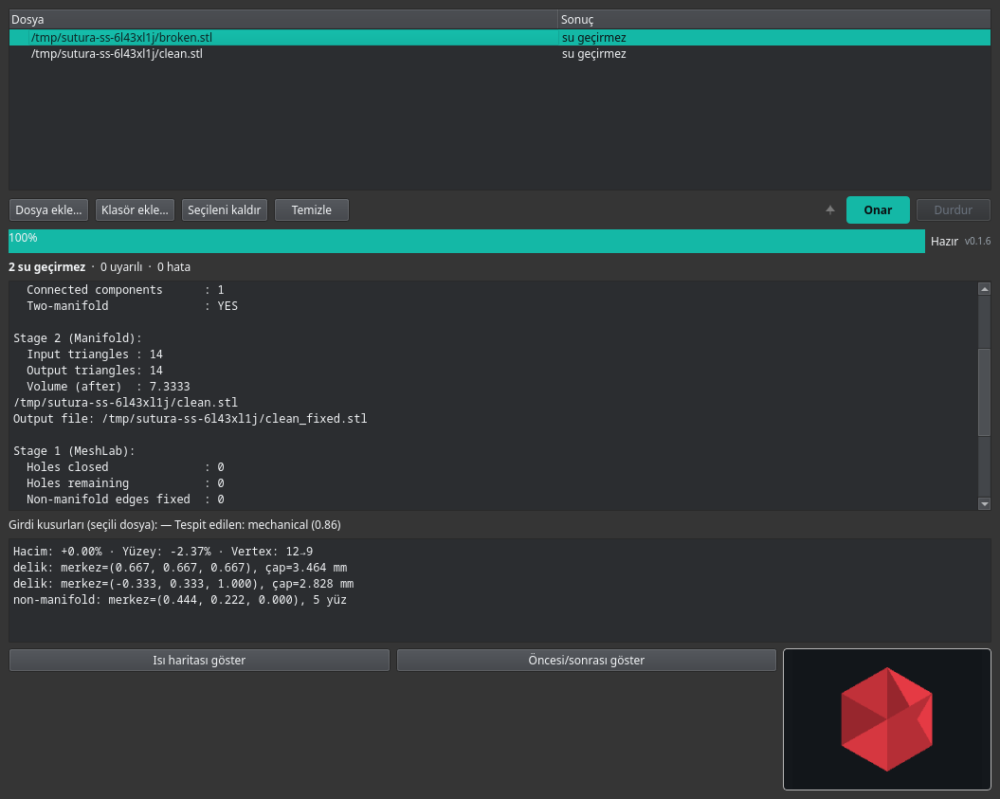
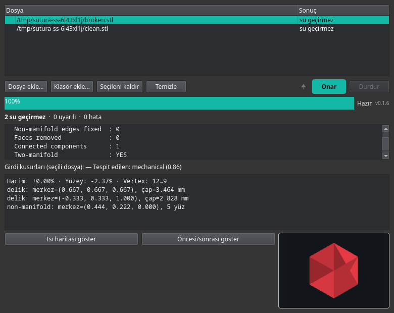

# Sutura

<p align="center">
  
</p>

<p align="center">
  
  
  
  
  
  
  
  
  
  
</p>

Two-stage mesh repair for STL and 3MF files, built for Linux with full
macOS support.

Linux has no direct equivalent of Windows' right-click "Fix model" (3D Builder,
Netfabb) or Bambu Studio's broken-on-Linux "Fix model" button. Sutura provides
that workflow: pick a mesh, repair it, keep the original untouched.

Sutura is continuously hardened against real-world inputs — Thingi10K models,
malformed files, adversarial inputs and torture scenarios (huge meshes, thin
walls, multi-part assemblies) — and every change is verified automatically by
CI on each push and pull request.

## Screenshot



## Why two stages

* **Stage 1 - PyMeshLab (VCG).** Removes duplicate and degenerate faces,
  repairs non-manifold edges and vertices, orients faces coherently, closes
  holes of *any* size, and drops tiny open debris components. VCG is the
  battle-tested classic for 3D-printing repair.
* **Stage 2 - manifold3d.** Rebuilds the closed mesh as a valid manifold
  solid and merges overlapping shells with a boolean union. This is the same
  library Bambu Studio uses; it guarantees the output is a single closed
  two-manifold.

Each stage fixes what the other cannot: VCG closes big holes but does not
resolve self-intersecting geometry; manifold3d guarantees a watertight result
but its Python binding rejects any input that is not already closed
(`Error.NotManifold`), so stage 1 must finish the mesh first.

On Linux, stage 2 runs in a dedicated python3.11 virtualenv (manifold3d
ships no wheel for Python 3.14). On single-environment installs (macOS/conda,
or any setup where manifold3d is importable from the current Python), stage 2
runs in-process instead. If manifold3d is not available at all, the report
explicitly says `Stage 2 skipped: manifold3d not available in this
environment.` — it is never silently omitted.

The original file is never overwritten. Output is written with a `_fixed`
suffix in the same directory.

## Feature status

A honest maturity snapshot of each major area — what is solid, what is a
known limitation, and where to be cautious. The percentages are an
assessment, not a metric; they are meant to tell you where you can trust
Sutura and where you should still double-check the output.

| Area | Maturity | What is solid / where to be careful |
|---|---|---|
| STL repair (two-stage) | ~95% | The VCG + manifold3d pipeline is CI-hardened against malformed/adversarial/torture inputs. Not 100%: pathological self-intersections can be reshaped by the stage-2 rebuild, and very large holes are closed with a flat patch, not a smart reconstruction. |
| 3MF multi-object | ~90% | Every object is repaired independently in memory and written back, so no object is lost. Known limits: per-object stage 2 is deliberately skipped, byte-identical objects are deduplicated, and a layered/duplicated-vertex 3MF can keep a few sub-millimetre cracks that slicers usually auto-heal. |
| Defect detection (holes / non-manifold) | ~90% | Stdlib+numpy, single source of truth, unit-tested on clean and broken cubes. Not 100%: it reports input defects only; on a mesh with thousands of micro-cracks the per-defect list gets large, and the CLI JSON omits index data (rendering-only). |
| GUI | ~85% | Native Qt batch repair, drag & drop, defect panel, heatmap, status/version row, i18n (EN/TR). Gaps: it shells out to the CLI (no in-process progress), the native KDE file dialog only works when the system Qt matches PySide6's, and there is no macOS Finder integration. |
| CLI | ~90% | Stable flags (`-o`, `--human`, `--defects`, `--diff`, `--version`), JSON reports, batch summary, exit codes. The `--human` report is English-only (localization is a GUI concern). |
| Batch processing | ~90% | Multi-file repair with per-file results and a summary. Hard stops (Ctrl-C / Stop) are handled; the batch summary is not resumable and a failed file does not halt the rest. |
| Defect heatmap | ~80% | On-demand CPU rasterizer (no GL), runs in a subprocess, never crashes the GUI. Deliberately CPU-only: offscreen OpenGL segfaults on headless systems, so it is flat-shaded with a three-point lighting model rather than full GL shading, and for multi-object 3MF it renders only the first object. |
| Before/after comparison | ~40% | Static CPU-rasterized toggle between original and repaired views, first version. Same GL constraint as the heatmap means it is a click-toggle, not an interactive 3D slider; only the first object is compared for multi-object 3MF, and it is visual-only (no metric readouts overlaid yet). |
| Mesh type-aware repair | ~70% | Heuristic mechanical/organic guess tunes two Stage 1 thresholds. Experimental: the per-type values are uncalibrated starting points, and curved-but-mechanical parts (cylinders, fillets) are not classified at all. |
| Cross-platform (Linux/macOS) | ~80% | Linux (install.sh + AppImage) and macOS (conda) both work, CI covers both. Gaps: macOS has no Finder integration, and the AppImage/GUI cannot self-update in place (read-only squashfs). |
| Auto-update | ~75% | Opt-in, backs up and rolls back on a failed self-check. Caveats: it is Linux/pip-install only (AppImage downloads a new release instead), and it talks to GitHub so it is not offline. |
| Dolphin integration | ~85% | Right-click service menu for STL/3MF, single/multi-select handled. Depends on KDE Plasma and `kbuildsycoca6` refresh; not available on other file managers or macOS. |
| OrcaSlicer plugin | ~35% — experimental | Self-contained script plugin, but **untested in a real OrcaSlicer**: it targets a plugin system only in nightly/2.4.2+ builds we have not run, its `execute()` cannot read the selected model (it repairs a configured file), and it is Linux-only. Treat it as a starting point, not a finished feature. |
| Test coverage | ~85% | Plain-script suites (smoke, layered 3MF, adversarial, classification, defects, mesh classifier, torture) run in CI on push/PR. Not 100%: the GUI itself has no automated UI test, and there is no reproducible end-to-end test against a live OrcaSlicer. |

## Requirements

Linux:

* `python3` (>= 3.11) with venv support, for the PyMeshLab venv
* `python3.11` specifically, for the manifold3d venv (manifold3d ships
  wheels only up to Python 3.13)
* KDE Plasma for the Dolphin service menu (optional; CLI and GUI work anywhere)

macOS (Apple Silicon / Intel):

* Homebrew and Miniforge (conda). pymeshlab has no PyPI wheel for Apple
  Silicon, so it must come from conda-forge; this is why macOS uses a single
  conda environment (`install-macos.sh`) rather than the Linux pip-only flow.
* Install Python 3.11 via conda (`install-macos.sh` does this automatically).

Linux Python 3.11 install:

* Arch / CachyOS: `sudo pacman -S python311`
* Debian / Ubuntu 22.04+: `sudo apt install python3.11 python3.11-venv`
* Fedora: `sudo dnf install python3.11`

On other distros, if your default `python3` *is* 3.11, no extra install is
needed.

## Troubleshooting

* **`python3.11` not found.** Stage 2 (manifold3d) needs Python 3.11 because
  it ships wheels only up to 3.13. Install it per distro:
  * Arch / CachyOS: `sudo pacman -S python311`
  * Debian / Ubuntu 22.04+: `sudo apt install python3.11 python3.11-venv`
  * Fedora: `sudo dnf install python3.11`
  Then run `install.sh` again — it reuses the existing virtualenvs.
* **PySide6 install fails.** The GUI needs `PySide6-Essentials`, which is
  installed into the `venv` from PyPI. On distros where `pip install
  PySide6-Essentials` fails (missing build tooling or a blocked PyPI), install
  the system Qt Python bindings instead and point the entry point at them:
  * Debian/Ubuntu: `sudo apt install python3-pyside6`
  * Fedora: `sudo dnf install python3-pyside6`
  * Arch: `sudo pacman -S pyside6` (in the official `extra` repository)
* **The GUI has no KDE file dialog.** The native dialog needs `plasma-integration`
  and a system Qt version that matches PySide6's. If the rubber-band selection
  is missing, Qt falls back to its embedded dialog — Ctrl/Shift+click still
  work for multi-selection.

## Install

### Linux

One line (fetches the latest `main` and installs):

```sh
curl -fsSL https://raw.githubusercontent.com/Krateian/Sutura/main/install.sh | bash
```

Or from a clone:

```sh
git clone https://github.com/Krateian/Sutura.git
cd Sutura
./install.sh
```

This creates two virtualenvs under `~/.local/share/sutura`, installs the CLI
wrapper at `~/.local/bin/sutura`, installs the hicolor app icons, and
registers the Dolphin service menu. Re-running is safe.

**AppImage (optional).** A self-contained AppImage with both Python runtimes
bundled (3.14 for stage 1 + GUI, 3.11 for stage 2) — no virtualenvs and no
system `python3.11` needed. Each tagged release ships a prebuilt
`Sutura-x86_64.AppImage` on the
[GitHub releases page](https://github.com/Krateian/Sutura/releases); you can
also build it yourself with `scripts/build_appimage.sh` (produces
`dist/Sutura-x86_64.AppImage`). Make it executable and run:

```sh
chmod +x Sutura-x86_64.AppImage
./Sutura-x86_64.AppImage            # GUI
./Sutura-x86_64.AppImage model.stl  # CLI (writes model_fixed.stl)
```

Unlike the `install.sh` flow, the AppImage build cannot update itself in
place; grab a new AppImage from the releases page above. The Dolphin
right-click service menu is still installed by `install.sh`.

Installation uses pip inside isolated virtualenvs — no AUR, no yay/paru
required, nothing touches your system package manager. The GUI needs
PySide6 (~79 MB download, part of the `venv`); total installed size for
the two virtualenvs is roughly 800 MB.

On Arch, if `python311` is not installed, install it first (see above).

### macOS

```sh
git clone https://github.com/Krateian/Sutura.git
cd Sutura
./install-macos.sh
```

`install-macos.sh` checks for Homebrew, installs Miniforge via Homebrew if
conda is missing, creates a `sutura-env` conda environment (Python 3.11),
installs pymeshlab from conda-forge and manifold3d/trimesh/PySide6 from pip,
verifies the imports, copies the app files to `~/.local/share/sutura/`, and
creates `~/.local/bin/sutura` (CLI) and `~/.local/bin/sutura-gui` launchers.
It is macOS-only and re-runnable.

Note: conda can be initialized non-interactively; if the script asks you to
restart the terminal for `conda init` to take effect, do so and re-run it.

## Usage

Runs fully offline after installation — no telemetry, no network calls
during repair, works without internet once installed.

Sutura checks GitHub for updates only if you opt in (disabled by default).
Updates back up the previous install automatically and roll back if the new
version fails a self-check — no data beyond the update check itself is sent.

CLI:

```sh
sutura model.stl            # writes model_fixed.stl
sutura model.3mf -o fixed.3mf
sutura model.stl --human    # human-readable report
sutura model.stl --human --defects   # also list input holes / non-manifold regions
sutura model.stl --human --diff      # also print the before/after geometry diff
sutura a.stl b.3mf c.stl    # batch: each file gets a _fixed output
sutura --version            # print the version and exit
```

With multiple files, every input is repaired in turn and a summary is
printed (`N watertight, M with warnings, K failed`), including a breakdown of
the kinds of warnings/errors that occurred (volume change, Stage 2 skipped,
partial repair, malformed input). The exit code is non-zero if any file
failed. In JSON mode each file's report also carries a `category`
(`watertight`/`warning`/`error`) and an `issues` list, and the batch summary
gains `summary.issue_counts`. `-o` is only valid with a single file. In JSON
mode each file's report also includes a `defects` list describing the input's
holes (centroid, diameter) and non-manifold regions; in `--human` mode this
list is shown only when `--defects` is passed, so the default report stays
concise. Diameter values assume millimetres, the common STL/3MF convention;
if your file uses a different unit, scale the interpretation accordingly.

Every report also records the before/after geometry in `stage1`:
`volume_change_percent` (signed), `surface_area_before`/`after` and
`surface_area_change_percent`, and `vertices_before`/`after`,
`faces_before`/`after`. These are always in the JSON and shown per object for
multi-object 3MF files; `--human --diff` prints them too, and the GUI defect
panel shows a one-line summary ("Volume: +0.12% · Surface: -2.37% · Vertex:
12→9").

A mesh is only counted as **watertight** when stage 2 actually ran and
validated the closed solid. If stage 1 closes a mesh but stage 2 is skipped,
errors, or never runs (for example the macOS/conda in-process fallback being
unavailable), the file is reported as a warning, not watertight.

Multi-object 3MF files are handled natively: every object mesh is repaired
independently and written back into the archive, so no object is lost. The
report lists the result per object (holes remaining, two-manifold). Defects
are also computed per object (`object_reports[i].defects`); there is no
top-level aggregate `defects` field for a 3MF. Note that, as in the batch
report, objects with byte-identical geometry are deduplicated: only the first
occurrence is reported.

GUI:

```sh
~/.local/share/sutura/gui.py
```

The GUI supports batch repair: add any number of files, press **Repair**,
and each one is processed in turn with its result listed per file. When the
batch finishes, a summary strip appears above the log (`X watertight, Y with
warnings, Z failed`) with a clickable **show issues** link that lists the
warning/error types and how many files each affected. Selecting a file shows
its input defects (holes with their diameter and non-manifold regions) in a
panel below the log, separate from the batch summary strip. Files can be added
with **Add files…** (native multi-select, rubber-band included), **Add
folder…** (every `.stl`/`.3mf` in the folder, one level deep), or by dragging
files or folders onto the window. **Stop** terminates the running repair and
marks the remaining files as cancelled. Drag & drop works on native Wayland
sessions (the GUI is a Qt application, not XWayland). The GUI ships its own
dark Fusion theme (teal accent), so it looks the same on every platform and
Qt version regardless of the system desktop theme.

#### Defect detail panel



When a file is selected, the panel below the log lists the defects found in
its input mesh: each hole's centroid and diameter (in mm) and each
non-manifold region. This complements the batch summary strip above the log —
the strip is a per-batch count, this panel is per-file detail.

**Defect heatmap.** Below the defect list, **Show heatmap** renders the
selected mesh with its defect regions (hole rims and non-manifold areas)
highlighted red against the grey mesh, shown as a small thumbnail. Clicking
the thumbnail opens a larger zoom dialog. Rendering is on-demand (never
automatic, so a large batch doesn't stall) and cached per file. For a
multi-object 3MF it renders the first object, matching the defect panel's
existing first-object behaviour. The renderer is a CPU rasterizer (works
headless, in the AppImage, and on macOS CI) that runs in a subprocess so the
GUI stays responsive and crash-free; if a mesh can't be rendered it falls
back silently to the text-only panel.

**Before/after comparison.** After a file is repaired, **Show before/after**
renders the original and repaired meshes with the *same* camera framing and
opens a dialog with a single image area and a toggle button that flips
between **Original** and **Repaired** (a static click-toggle, deliberately not
an interactive 3D slider — same CPU-renderer constraint as the heatmap). It
runs in a subprocess and is on-demand, so it never slows a batch.

Dolphin: right-click an STL/3MF file -> **Repair with Sutura**. With a single
selection the GUI opens with the file loaded; with multiple selections each
file is repaired headlessly and a summary dialog is shown.

After installing or removing the service menu, run `kbuildsycoca6` (the
installer does this automatically) or restart Dolphin.

### OrcaSlicer plugin (experimental)

There is also an **experimental** [OrcaSlicer script plugin](orcaslicer-plugin/)
under `orcaslicer-plugin/` that repairs a file straight from the slicer by
shelling out to the installed Sutura CLI. It is offered as a starting point
and is **untested in a real OrcaSlicer**: the Python plugin system it targets
only exists in OrcaSlicer **nightly builds / releases newer than 2.4.2**,
which we do not run, so we have not been able to verify it end-to-end. See the
[plugin README](orcaslicer-plugin/README.md) for install steps and its
limitations.

## Mesh type-aware repair

Sutura heuristically guesses whether an input mesh is **mechanical** (cube,
gear, CAD part) or **organic** (sculpt, scanned model) from pure geometry —
adjacent-face dihedral angles, computed in numpy. It is *not* an ML model and
is deliberately conservative: it only acts on high-confidence cases and
reports `unknown` otherwise, in which case the historical default Stage 1
parameters are used unchanged.

The confidence is a **signed-margin score**: each metric (near-90° dihedral
fraction, near-coplanar fraction) is mapped through a smooth sigmoid and the
two signals are combined (mechanical = OR, organic = AND), so the decision is
a soft margin rather than a single hard threshold — there is no sharp jump at
the `[55,60]` near90 boundary. An `unknown` result still carries a non-zero
proximity value (which class the mesh leans toward, and how close) instead of
a flat 0, so even the fallback is informative.

The detected type is shown in the GUI defect-panel header (e.g. `Detected:
mechanical (0.92)`) and in the `--human` report as a `Type:` line; the JSON
report carries `detected_type` and `detected_confidence`. A calibration
harness (`scripts/calibrate_classifier.py`) measures precision/recall and
confidence separation against a labeled synthetic set
(`tests/make_classifier_set.py`), so the thresholds stay checkable and
reversible.

When classified, the type tunes two Stage 1 thresholds:

| Type | `mincomponentsize` (debris cutoff) | `maxholesize` (hole fill) | Effect |
|---|---|---|---|
| mechanical | 8 | 300 | preserve small sharp details, avoid oversized hole patches |
| organic | 12 | 1000 | drop scan debris more aggressively, close large open regions |
| unknown | 8 | 1000 | historical defaults (unchanged) |

> These per-type values are **experimental starting points**, not calibrated
> on real repair data — a conservative, reversible choice. Only the two
> thresholds above shift; they can be tuned in `repair.py` as more samples are
> collected.

### Known limitation of the classifier

Curved-but-mechanical parts (e.g. a cylinder, shaft, or filleted geometry) are
**not** classified — they fall into the `unknown` bucket and keep the default
parameters. This is a deliberate trade-off: the classifier only fires on
clearly flat/sharp mechanical or clearly smooth organic meshes, and prefers to
do nothing over applying a wrong parameter set.

## Test

Synthetic broken mesh:

```sh
python3 tests/make_broken_stl.py /tmp/broken.stl
sutura /tmp/broken.stl --human
```

The generator produces a cube with a missing face, an inverted winding, a
duplicated face, a fin triangle and a self-intersecting triangle.

Regression suites:

```sh
python3 tests/make_layered_multiobject_3mf.py --check   # layered multi-object 3MF
python3 tests/test_adversarial.py                       # malformed-input handling
```

Real-world samples in `tests/real-world-samples/` come from the
[Thingi10K](https://ten-thousand-models.appspot.com/) dataset (Zhou &
Jacobson): three genuinely broken models — one non-manifold, one
self-intersecting, one both. They retain their original licenses from the
Thingi10K metadata; see `tests/real-world-samples/README.md` for details
and the repair result expected from each.

Torture tests cover hard-but-printable geometry:

```sh
python3 tests/torture_tests.py
```

This runs four scenarios and reports the before/after for each: a 5M-triangle
sphere (repair time), a 0.05 mm thin slab (feature-loss risk — it must survive
intact), a multi-part assembly (the 8-face debris-removal threshold must not
delete legitimate parts), and a rough scan-style mesh with many micro-cracks
(residual-holes expectation).

## Robustness

Malformed or hostile inputs are rejected with a clear error and a non-zero
exit code, never a crash or a silently wrong result:

| Input | Behaviour |
|---|---|
| Truncated / cut-off binary STL | rejected: "Unable to open file ... Malformed file" |
| Header claims more triangles than the file holds | rejected: "Malformed file" |
| NaN/Infinity vertex coordinates | rejected: "input mesh contains NaN or infinite coordinates" |
| Empty mesh (0 triangles) | rejected: "input mesh is empty (no triangles)" |
| Fully degenerate mesh (only zero-area faces) | rejected: "all faces are degenerate; nothing to repair" |
| Wrong extension (OBJ content in `.stl`, or the reverse) | rejected: "Unable to open file" |

Any of these returns exit code 1, so scripts can reliably detect failure.

## Libraries

| Library | Role | Why |
|---|---|---|
| PyMeshLab | stage 1 filter chain | VCG-based, proven for print repair, fills holes of any size, Python 3.14 wheel available |
| manifold3d | stage 2 solid rebuild | watertight guarantee, robust boolean, same engine as Bambu Studio |
| trimesh | stage 2 IO | OBJ/mesh loading in the manifold venv |

Pinned in `requirements.txt` and `requirements-311.txt`.

## Known limitations

* **macOS has no right-click / Finder integration yet.** On macOS only the
  CLI and the GUI are available; there is no equivalent of Linux's Dolphin
  service menu ("Repair with Sutura"). macOS users run `sutura-gui` or
  `sutura <file>` from a terminal.
* **Native KDE file dialog.** The GUI sets `QT_QPA_PLATFORMTHEME=kde` and
  points `QT_PLUGIN_PATH` at `/usr/lib/qt6/plugins` so QFileDialog uses the
  native KDE dialog (rubber-band rectangle selection included). This works
  only when the system Qt version matches the bundled PySide6 Qt — the GUI
  checks the versions (via `qmake`) and only mixes in the system plugins on a
  match. When they differ (e.g. system Qt 6.11.2 vs bundled 6.11.1), the
  system platform plugins cannot load into the bundled Qt, so the GUI keeps
  Qt on its own bundled plugins and falls back to the embedded dialog —
  rectangle selection may be unavailable, but Ctrl/Shift+click always works.
* **Self-intersections within one connected shell.** manifold3d rebuilds the
  mesh as a solid, which resolves interior/overlapping geometry, but the
  rebuild can slightly reshape features in pathological cases. Always check
  the result in a slicer.
* **Large hole patches.** VCG fills holes with flat triangulated patches; for
  very large holes the fill is a simple patch, not a smart reconstruction.
  It closes the mesh, but the patch quality is average and may need smoothing.
* **Tiny disconnected debris.** Components with fewer than 8 faces are
  removed. A small legitimate part that is not connected to the main body
  will be removed too.
* **Inverted whole models.** If the repaired volume comes out negative, the
  whole mesh is flipped; a model that was consistently wound "inside out"
  will be corrected automatically.
* **manifold3d Python binding.** It rejects any input with open edges; if
  stage 1 cannot close a hole, stage 2 is skipped and the stage 1 result is
  used as-is (the report says so).
* **Layered/duplicated-vertex 3MF exports.** Some slicers (Bambu Studio
  included) write 3MFs whose objects repeat every vertex position ~15x as
  separate vertex entries, and whose surfaces are folded (several faces
  coincident on one edge). VCG can turn such meshes into valid 2-manifolds,
  but a few sub-millimetre cracks may remain that `close_holes` refuses to
  fill (the fill patch would be degenerate). The result is two-manifold but
  not always fully watertight; most slicers auto-heal cracks this small on
  import. Example from development: a 2-object Bambu export ended with 13
  and 26 remaining micro-holes per object after the best possible VCG pass.
* **All objects are preserved.** Multi-object 3MFs are repaired object by
  object and written back, so no object is lost. The per-object result is
  reported in the CLI output and the GUI.

## Contributing

Missing a feature? Found a mesh that won't repair? Open an issue. A good
bug report is worth far more than a bare "it doesn't work", so when you
report a mesh please include:

* the `sutura <file> --human` output (or the JSON report),
* the command you ran,
* and, if you know it, how the mesh was produced — slicer, scanner, CAD
  export, etc.

This makes the root cause much easier to pin down. Structured reports are
encouraged: see `.github/ISSUE_TEMPLATE/bug_report.md`.

## License

Apache License 2.0. See `LICENSE`.

This project also includes a `NOTICE` file (Apache 2.0 §4d) preserving
attribution; if you redistribute or build on Sutura, please keep it intact.